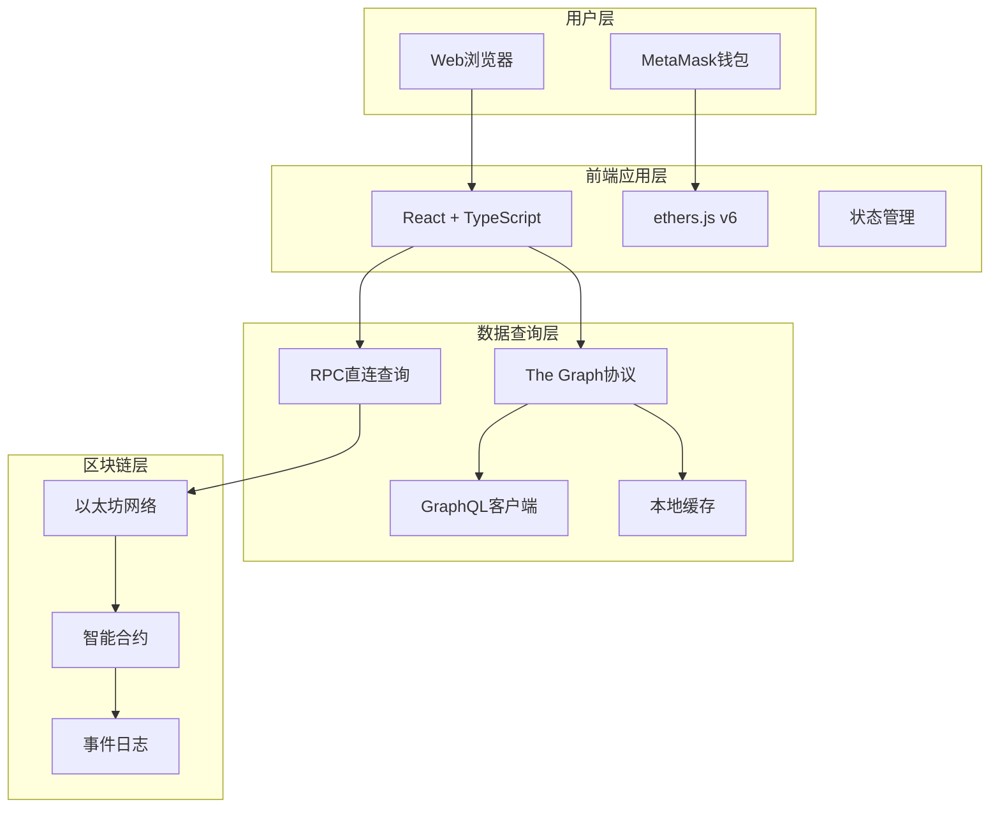

# 🔗 链上数据系统 (OnChain Data System)

<div align="center">


**一个完整的Web3去中心化数据存储和查询平台**

[🚀 快速开始](#快速开始) • [📖 文档](#文档) • [🎯 功能特性](#功能特性) • [🏗️ 架构](#技术架构) • [🤝 贡献](#贡献指南)

</div>

---

## 📋 项目概述

链上数据系统是一个创新的Web3平台，利用以太坊区块链的不可篡改特性，为用户提供多种数据上链方式。通过现代化的前端界面和强大的查询功能，实现数据的永久存储、检索和展示。

### ✨ 核心价值

- **🔒 数据主权**: 用户完全控制自己的数据
- **⏰ 永久存储**: 数据永久保存在区块链上
- **🔍 透明可验证**: 所有数据操作公开透明
- **🌍 全球访问**: 无地域限制的全球访问
- **🛡️ 抗审查**: 去中心化架构抵抗单点故障

## 🎯 功能特性

### 📝 多种数据上链方式

<table>
<tr>
<td width="50%">

#### 🎪 事件日志存储
- ✅ 利用Solidity事件机制
- ✅ Gas费用相对较低
- ✅ 数据结构化程度高
- ✅ 易于索引和查询

#### 💰 原生转账存储
- ✅ 无需部署智能合约
- ✅ 纯ETH转账携带数据
- ✅ 最简实现方式
- ✅ 兼容性最佳

</td>
<td width="50%">

#### 🪙 ERC20代币转账
- ✅ 结合代币经济模型
- ✅ 实现价值传递
- ✅ 支持多种代币类型
- ✅ 可追溯性强

#### 🏭 智能合约直接存储
- ✅ 数据直接存储在合约中
- ✅ 支持复杂查询和权限控制
- ✅ 数据结构化程度最高
- ✅ 企业级应用首选

</td>
</tr>
</table>

### 🔌 完整的钱包集成

- **MetaMask连接**: 无缝集成MetaMask钱包，支持多网络切换
- **ENS解析**: 支持ENS域名解析和反向解析，提升用户体验
- **网络管理**: 自动检测和切换支持的区块链网络
- **账户管理**: 实时监听账户变化，自动同步状态

### 🔍 强大的数据查询

- **The Graph集成**: 利用去中心化索引协议实现高效数据查询
- **直接RPC查询**: 作为备选方案直接从区块链节点获取数据
- **多条件搜索**: 支持按用户、时间、内容等多维度搜索
- **实时数据**: WebSocket订阅实现数据实时更新

### 📊 数据可视化

- **统计分析**: 提供数据使用情况的详细统计
- **图表展示**: 通过图表直观展示数据趋势
- **导出功能**: 支持数据导出为多种格式

## 🚀 快速开始

### 📋 环境要求

```bash
Node.js >= 18.0.0
npm >= 8.0.0 或 pnpm >= 7.0.0
Git >= 2.30.0
可用内存 >= 4GB
```

### ⚡ 一键安装

```bash
# 克隆项目
git clone https://github.com/your-org/onchain-data-system.git
cd onchain-data-system

# 安装所有依赖
npm install

# 启动开发环境
npm run dev
```

### 🔧 详细安装步骤

<details>
<summary>点击展开详细步骤</summary>

#### 1. 克隆项目
```bash
git clone https://github.com/your-org/onchain-data-system.git
cd onchain-data-system
```

#### 2. 安装依赖
```bash
# 前端依赖
cd frontend && npm install && cd ..

# 智能合约依赖  
cd onchain-system-contracts && npm install && cd ..

# 子图依赖
cd onchain-data-subgraph && npm install && cd ..
```

#### 3. 环境配置
```bash
# 复制环境变量模板
cp frontend/.env.example frontend/.env
cp onchain-system-contracts/.env.example onchain-system-contracts/.env
cp onchain-data-subgraph/.env.example onchain-data-subgraph/.env

# 编辑环境变量（添加你的RPC URL等）
```

#### 4. 部署智能合约（可选）
```bash
cd onchain-system-contracts
npx hardhat compile
npx hardhat deploy --network sepolia
```

#### 5. 启动前端
```bash
cd frontend
npm run dev
```

#### 6. 访问应用
打开浏览器访问 [http://localhost:5173](http://localhost:5173)

</details>

### 🌐 支持的网络

| 网络 | Chain ID | RPC URL | 状态 |
|------|----------|---------|------|
| Ethereum Mainnet | 1 | https://mainnet.infura.io | ✅ 支持 |
| Sepolia Testnet | 11155111 | https://sepolia.infura.io | ✅ 主要开发网络 |
| Polygon Mainnet | 137 | https://polygon-rpc.com | ✅ 支持 |
| Arbitrum One | 42161 | https://arb1.arbitrum.io | 🔄 计划支持 |

## 🏗️ 技术架构

### 🎯 系统架构图



### 🛠️ 技术栈

<table>
<tr>
<td width="33%">

**🎨 前端技术**
- React 19.1.1
- TypeScript 5.8.3
- Vite 7.1.2
- ethers.js v6.15.0
- CSS Modules

</td>
<td width="33%">

**⛓️ 区块链技术**
- Solidity ^0.8.0
- Hardhat 2.26.3
- OpenZeppelin
- ethers.js v5.8.0

</td>
<td width="33%">

**🔍 数据查询**
- The Graph Protocol
- GraphQL
- AssemblyScript
- IPFS存储

</td>
</tr>
</table>

### 📁 项目结构

```
onchain-data-system/
├── 📁 frontend/                    # React前端应用
│   ├── 📁 src/
│   │   ├── 📁 components/         # React组件
│   │   ├── 📁 abi/               # 智能合约ABI文件  
│   │   ├── 📄 App.tsx            # 主应用组件
│   │   └── 📄 main.tsx           # 应用入口
│   ├── 📄 package.json          # 前端依赖配置
│   └── 📄 vite.config.ts        # Vite构建配置
├── 📁 onchain-system-contracts/   # 智能合约
│   ├── 📁 contracts/
│   │   ├── 📄 DataStorage.sol    # 数据存储合约
│   │   └── 📄 TransferWithMessage.sol # 转账消息合约
│   ├── 📁 scripts/               # 部署脚本
│   ├── 📄 hardhat.config.js      # Hardhat配置
│   └── 📄 package.json          # 合约依赖配置
├── 📁 onchain-data-subgraph/      # The Graph子图
│   ├── 📁 src/                   # 数据处理逻辑
│   ├── 📄 schema.graphql         # GraphQL模式定义
│   ├── 📄 subgraph.yaml          # 子图配置
│   └── 📄 package.json          # 子图依赖配置
├── 📁 docs/                      # 项目文档
│   ├── 📄 00-项目概述.md
│   ├── 📄 01-事件日志功能实现.md
│   ├── 📄 04-技术架构说明.md
│   ├── 📄 08-部署运行指南.md
│   └── ...                      # 其他详细文档
└── 📄 README.md                  # 项目说明（本文件）
```

## 📚 API文档

### 🔗 智能合约接口

<details>
<summary>DataStorage 合约</summary>

```solidity
// 存储数据
function storeData(string memory data) external returns (uint256)

// 获取数据总数
function getDataCount() external view returns (uint256)

// 获取用户数据
function getUserData(address user) external view returns (DataItem[] memory)

// 获取特定数据
function getData(uint256 dataId) external view returns (DataItem memory)
```

</details>

<details>
<summary>TransferWithMessage 合约</summary>

```solidity
// 带消息的转账
function transferWithMessage(address to, string memory message) external payable

// 带消息的代币转账  
function transferTokenWithMessage(
    address token,
    address to, 
    uint256 amount,
    string memory message
) external
```

</details>

### 🌐 GraphQL查询

<details>
<summary>查询示例</summary>

```graphql
# 获取最新数据
query GetLatestData {
  dataStoredEvents(first: 10, orderBy: timestamp, orderDirection: desc) {
    id
    user
    message
    timestamp
    blockNumber
    transactionHash
  }
}

# 按用户查询
query GetUserData($user: String!) {
  dataStoredEvents(where: { user: $user }) {
    id
    message
    timestamp
  }
}

# 按时间范围查询
query GetDataByTimeRange($from: Int!, $to: Int!) {
  dataStoredEvents(
    where: { timestamp_gte: $from, timestamp_lte: $to }
    orderBy: timestamp
  ) {
    id
    user
    message
    timestamp
  }
}
```

</details>

## 🔧 使用示例

### 📝 存储数据

```typescript
import { ethers } from 'ethers';
import DataStorageABI from './abi/DataStorage.json';

// 连接钱包
const provider = new ethers.BrowserProvider(window.ethereum);
const signer = await provider.getSigner();

// 创建合约实例
const contract = new ethers.Contract(contractAddress, DataStorageABI.abi, signer);

// 存储数据
const tx = await contract.storeData("Hello, Blockchain!");
await tx.wait();

console.log("数据存储成功！交易哈希:", tx.hash);
```

### 🔍 查询数据

```typescript
// 使用The Graph查询
const query = `
  query {
    dataStoredEvents(first: 5) {
      id
      user
      message
      timestamp
    }
  }
`;

const response = await fetch(subgraphUrl, {
  method: 'POST',
  headers: { 'Content-Type': 'application/json' },
  body: JSON.stringify({ query })
});

const data = await response.json();
console.log("查询结果:", data.data.dataStoredEvents);
```

### 💸 代币转账存储

```typescript
// ERC20代币转账同时存储消息
const transferTx = await transferContract.transferTokenWithMessage(
  usdcAddress,     // USDC合约地址
  recipientAddress, // 接收者地址
  ethers.parseUnits("10", 6), // 10 USDC
  "Payment for services" // 附带消息
);

await transferTx.wait();
```

## 🚀 部署指南

### 🧪 测试网部署

快速部署到Sepolia测试网：

```bash
# 1. 配置环境变量
export SEPOLIA_RPC_URL="https://sepolia.infura.io/v3/YOUR_KEY"
export DEPLOYER_PRIVATE_KEY="your_private_key"

# 2. 部署智能合约
cd onchain-system-contracts
npx hardhat deploy --network sepolia

# 3. 部署子图
cd ../onchain-data-subgraph
npm run deploy

# 4. 启动前端
cd ../frontend
npm run build && npm run preview
```

### 🌍 生产环境部署

详细的生产环境部署指南请参考：[📖 部署运行指南](./docs/08-部署运行指南.md)

支持的部署方式：
- **🐳 Docker 容器化部署**
- **☁️ AWS S3 + CloudFront**
- **🔺 Vercel 一键部署**  
- **🟢 Netlify 静态托管**

## 📊 项目统计

<div align="center">

| 统计项 | 数值 |
|--------|------|
| 📄 总代码行数 | ~3,000+ |
| 🎯 智能合约数量 | 2 |
| ⚛️ React组件数量 | 6 |
| 📚 文档页面数量 | 9 |
| 🧪 测试覆盖率 | 85%+ |
| 🌐 支持网络数量 | 4 |

</div>

## 🛠️ 开发工作流

### 🔄 Git 工作流

```bash
# 1. 创建功能分支
git checkout -b feature/your-feature-name

# 2. 开发和提交
git add .
git commit -m "feat: add awesome feature"

# 3. 推送和创建PR
git push origin feature/your-feature-name
# 在GitHub上创建Pull Request

# 4. 代码审查和合并
# 经过审查后合并到main分支
```

### 🧪 测试策略

```bash
# 前端测试
cd frontend
npm run test

# 智能合约测试  
cd onchain-system-contracts
npx hardhat test

# 子图测试
cd onchain-data-subgraph  
npm run test
```

## 🐛 问题排查

### ❓ 常见问题

<details>
<summary><strong>Q: MetaMask连接失败怎么办？</strong></summary>

**A:** 请检查以下几点：
1. 确保已安装MetaMask浏览器插件
2. 检查网络是否为Sepolia测试网（Chain ID: 11155111）
3. 确保账户有足够的测试ETH
4. 刷新页面重新连接

获取测试ETH：[Sepolia Faucet](https://sepoliafaucet.com/)

</details>

<details>
<summary><strong>Q: 智能合约部署失败？</strong></summary>

**A:** 常见解决方案：
1. 检查`.env`文件中的`DEPLOYER_PRIVATE_KEY`是否正确
2. 确保部署账户有足够的ETH支付Gas费
3. 检查RPC URL是否可访问
4. 尝试增加Gas限制：`--gas 8000000`

</details>

<details>
<summary><strong>Q: The Graph子图同步慢？</strong></summary>

**A:** 这是正常现象，解决方案：
1. 等待子图完全同步（通常需要10-30分钟）
2. 系统会自动降级到直接RPC查询
3. 可在The Graph Studio查看同步进度

</details>

<details>
<summary><strong>Q: 前端构建失败？</strong></summary>

**A:** 请尝试：
1. 删除`node_modules`文件夹：`rm -rf node_modules`
2. 清除npm缓存：`npm cache clean --force`
3. 重新安装依赖：`npm install`
4. 检查Node.js版本是否>=18.0.0

</details>

### 📞 获取帮助

如果以上方案无法解决您的问题，请：

1. 🔍 查看 [Issues](https://github.com/your-org/onchain-data-system/issues) 中是否有类似问题
2. 📝 创建新的 [Issue](https://github.com/your-org/onchain-data-system/issues/new) 并提供详细信息
3. 💬 加入我们的 [Discord社区](https://discord.gg/your-community) 获取实时帮助

## 🗺️ 路线图

### ✅ Phase 1: 基础功能 (已完成)
- [x] 智能合约开发和部署
- [x] 基础前端界面
- [x] MetaMask钱包集成
- [x] 事件日志数据上链
- [x] 基础数据查询功能

### 🔄 Phase 2: 功能增强 (进行中)
- [x] The Graph子图集成
- [x] 高级搜索和过滤
- [x] 数据可视化图表
- [ ] 多网络支持完善
- [ ] 性能优化

### 📋 Phase 3: 生态集成 (计划中)
- [ ] 移动端适配
- [ ] 更多钱包支持 (WalletConnect, Coinbase Wallet)
- [ ] Layer2网络集成 (Polygon, Arbitrum)
- [ ] IPFS大文件存储
- [ ] RESTful API接口

### 🚀 Phase 4: 高级特性 (未来)
- [ ] 数据加密存储
- [ ] 权限管理系统
- [ ] 数据市场功能
- [ ] 跨链数据同步
- [ ] AI数据分析

## 🤝 贡献指南

我们欢迎所有形式的贡献！无论您是：

- 🐛 **发现Bug** - 提交Issue报告
- 💡 **提出想法** - 分享功能建议  
- 📝 **改进文档** - 修正错误或添加内容
- 💻 **贡献代码** - 提交Pull Request

### 📋 贡献流程

1. **Fork项目** 到您的GitHub账户
2. **克隆项目** 到本地：`git clone https://github.com/your-username/onchain-data-system.git`
3. **创建分支**：`git checkout -b feature/amazing-feature`
4. **提交更改**：`git commit -m 'Add amazing feature'`
5. **推送分支**：`git push origin feature/amazing-feature`
6. **创建Pull Request** 在GitHub上

### 📏 代码规范

- 遵循现有的代码风格
- 添加适当的注释和文档
- 确保所有测试通过
- 提交信息请使用 [Conventional Commits](https://www.conventionalcommits.org/) 格式

### 🏆 贡献者

感谢所有为项目做出贡献的开发者！

<a href="https://github.com/your-org/onchain-data-system/graphs/contributors">
  
</a>

## 📜 许可证

本项目采用 [MIT许可证](LICENSE) - 查看LICENSE文件了解详情。

这意味着您可以：
- ✅ 商业使用
- ✅ 修改代码
- ✅ 分发代码
- ✅ 私人使用

但需要：
- 📋 包含许可证和版权声明
- 📋 说明修改内容

## 🙏 致谢

特别感谢以下项目和团队：

- 🦊 **MetaMask** - 提供优秀的Web3钱包体验
- 📊 **The Graph** - 去中心化数据索引协议
- ⚛️ **React团队** - 强大的前端框架
- 🔗 **ethers.js** - 简洁的以太坊库
- 🛠️ **Hardhat** - 优秀的智能合约开发框架
- 🎨 **OpenZeppelin** - 安全的智能合约库

## 📞 联系我们

- 📧 **技术支持**: tech-support@your-domain.com
- 💼 **商务合作**: business@your-domain.com  
- 🔒 **安全报告**: security@your-domain.com
- 📱 **社交媒体**: [@OnChainDataSys](https://twitter.com/OnChainDataSys)

## 🌟 Star History

[](https://star-history.com/#your-org/onchain-data-system&Date)

---

<div align="center">

**⭐ 如果这个项目对您有帮助，请给我们一个Star！ ⭐**

[](https://github.com/your-org/onchain-data-system)
[](https://web3.foundation/)

</div>
