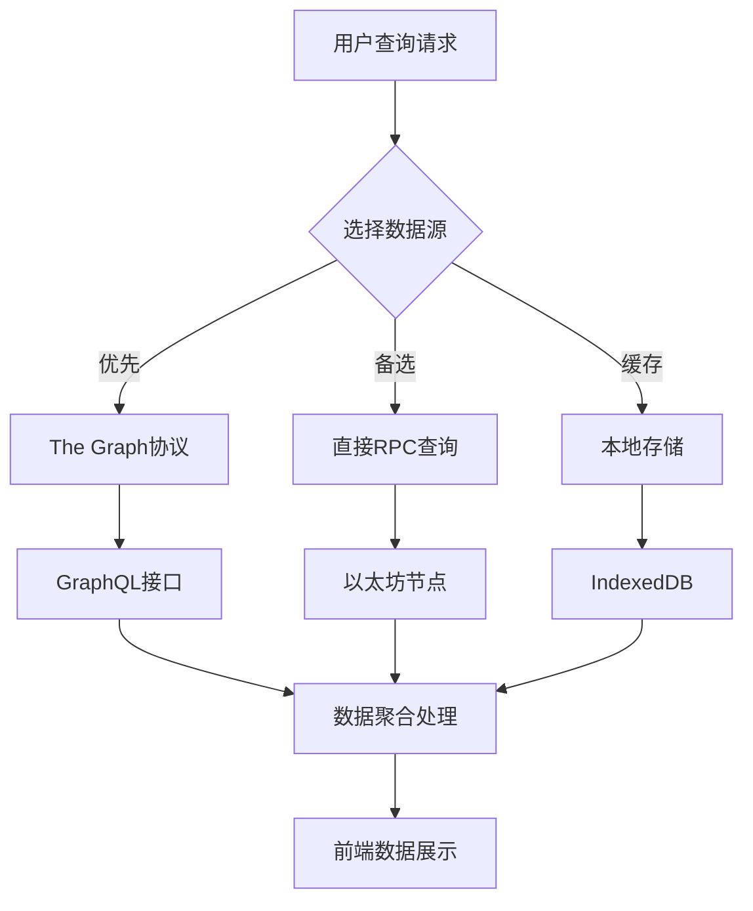

# 链上数据系统项目概述

## 项目简介

链上数据系统（OnChain Data System）是一个完整的Web3去中心化数据存储和查询平台。该系统利用以太坊区块链的不可篡改特性，为用户提供多种数据上链方式，并通过现代化的前端界面和强大的查询功能，实现数据的永久存储、检索和展示。

## 核心特性

### 🔗 多种数据上链方式
- **事件日志存储**: 通过智能合约事件机制记录数据，成本低效率高
- **原生转账存储**: 利用ETH原生转账的data字段存储信息，无需合约，最简实现
- **ERC20代币转账**: 通过ERC20代币转账同时实现价值传递和数据存储
- **智能合约直接存储**: 将数据直接存储在智能合约的状态变量中，支持复杂查询

### 💼 完整的钱包集成
- **MetaMask连接**: 无缝集成MetaMask钱包，支持多网络切换
- **ENS解析**: 支持ENS域名解析和反向解析，提升用户体验
- **网络管理**: 自动检测和切换支持的区块链网络
- **账户管理**: 实时监听账户变化，自动同步状态

### 🔍 强大的数据查询
- **The Graph集成**: 利用去中心化索引协议实现高效数据查询
- **直接RPC查询**: 作为备选方案直接从区块链节点获取数据
- **多条件搜索**: 支持按用户、时间、内容等多维度搜索
- **实时数据**: WebSocket订阅实现数据实时更新

### 📊 数据可视化
- **统计分析**: 提供数据使用情况的详细统计
- **图表展示**: 通过图表直观展示数据趋势
- **导出功能**: 支持数据导出为多种格式

## 技术架构

### 前端技术栈
```
React 18 + TypeScript
├── ethers.js v6          # 区块链交互库
├── React Hooks          # 状态管理
├── CSS Modules          # 样式解决方案
├── Chart.js             # 数据可视化
├── React Query          # 数据缓存和同步
└── React Window         # 虚拟滚动优化
```

### 智能合约技术栈
```
Solidity ^0.8.0
├── Truffle Suite        # 开发框架
├── OpenZeppelin         # 安全库
├── Ganache              # 本地测试网络
└── Web3 Provider        # 区块链连接
```

### 后端服务
```
The Graph Protocol
├── GraphQL API         # 数据查询接口
├── Subgraph定义        # 数据索引规则
├── AssemblyScript      # 数据处理逻辑
└── IPFS存储            # 去中心化文件系统
```

### 支持的区块链网络
- **以太坊主网** (chainId: 1)
- **Sepolia测试网** (chainId: 11155111) - 主要开发网络
- **Polygon主网** (chainId: 137) 
- **Arbitrum One** (chainId: 42161)

## 项目结构

```
onchain-data-system/
├── frontend/                    # 前端应用
│   ├── src/
│   │   ├── components/         # React组件
│   │   │   ├── WalletConnect.tsx     # 钱包连接组件
│   │   │   ├── LogForm.tsx           # 事件日志表单
│   │   │   ├── NativeTransferForm.tsx # 原生转账表单
│   │   │   ├── TokenForm.tsx         # 代币转账表单
│   │   │   └── DataList.tsx          # 数据查询列表
│   │   ├── abi/               # 智能合约ABI文件
│   │   ├── hooks/             # 自定义React Hooks
│   │   ├── utils/             # 工具函数
│   │   └── styles/            # 样式文件
│   ├── public/                # 静态资源
│   └── package.json          # 依赖配置
├── onchain-system-contracts/   # 智能合约
│   ├── contracts/
│   │   ├── DataStorage.sol    # 数据存储合约
│   │   ├── TokenSwap.sol      # 代币交换合约
│   │   └── Migrations.sol     # 迁移合约
│   ├── migrations/            # 部署脚本
│   ├── test/                  # 合约测试
│   └── truffle-config.js      # Truffle配置
├── onchain-data-subgraph/      # The Graph子图
│   ├── src/                   # 数据处理逻辑
│   ├── schema.graphql         # GraphQL模式定义
│   ├── subgraph.yaml          # 子图配置
│   └── package.json          # 依赖配置
├── docs/                      # 项目文档
│   ├── 00-项目概述.md
│   ├── 01-事件日志功能实现.md
│   ├── 02-原生转账功能实现.md
│   ├── 03-代币交易功能实现.md
│   ├── 04-技术架构说明.md
│   ├── 05-钱包连接功能实现.md
│   ├── 06-数据查询功能实现.md
│   ├── 07-API接口文档.md
│   ├── 08-部署运行指南.md
│   └── 09-智能合约直接存储功能实现.md
└── README.md                  # 项目说明
```

## 核心功能模块

### 1. 数据上链模块
该模块提供四种不同的数据上链方式，满足不同场景需求：

**智能合约事件存储**
- 利用Solidity事件机制
- Gas费用相对较低
- 数据结构化程度高
- 易于索引和查询

**原生转账存储**
- 无需部署智能合约
- 无需调用合约函数
- 纯ETH转账携带数据
- 最简实现方式

**ERC20代币转账**
- 结合代币经济模型
- 实现价值传递
- 支持多种代币类型
- 可追溯性强

**智能合约直接存储**
- 数据直接存储在合约状态变量中
- 支持复杂查询和权限控制
- 数据结构化程度最高
- 企业级应用首选

### 2. 钱包连接模块
提供完整的Web3钱包集成方案：

**多钱包支持**
- MetaMask (主要支持)
- WalletConnect (计划支持)
- Coinbase Wallet (计划支持)

**网络管理**
- 自动网络检测
- 一键网络切换
- 自定义网络添加
- 网络状态监控

**ENS集成**
- ENS域名解析
- 反向域名解析
- 头像获取
- 域名验证

### 3. 数据查询模块
强大的数据检索和展示功能：

**多数据源查询**


**高级搜索功能**
- 多维度筛选 (用户地址、时间范围、内容关键词)
- 分页加载优化
- 虚拟滚动支持
- 实时数据订阅

**数据可视化**
- 交易统计图表
- 用户活跃度分析
- 数据趋势展示
- 自定义报表生成

## 安全特性

### 智能合约安全
- **OpenZeppelin安全库**: 使用业界标准的安全合约库
- **访问控制**: 实现基于角色的权限管理
- **重入攻击防护**: 使用ReentrancyGuard保护
- **溢出保护**: Solidity 0.8+内置溢出检查
- **事件审计**: 所有关键操作都触发事件记录

### 前端安全
- **输入验证**: 严格的用户输入验证和清理
- **XSS防护**: 使用React内置的XSS防护机制
- **私钥保护**: 永不存储或传输用户私钥
- **HTTPS强制**: 生产环境强制使用HTTPS
- **内容安全策略**: 实施严格的CSP策略

### 数据安全
- **端到端加密**: 敏感数据传输加密
- **数据完整性**: 利用区块链保证数据不可篡改
- **隐私保护**: 可选的数据加密存储
- **备份机制**: 多重数据备份策略

## 性能优化

### 前端性能
```typescript
// 代码分割
const LazyComponent = React.lazy(() => import('./Component'));

// 虚拟滚动
import { FixedSizeList as List } from 'react-window';

// 数据缓存
import { useQuery } from 'react-query';

// 防抖处理
const debouncedSearch = useMemo(
  () => debounce(handleSearch, 300),
  []
);
```

### 区块链交互优化
- **批量查询**: 合并多个RPC请求
- **智能缓存**: 缓存不变的区块链数据
- **连接复用**: 复用Web3Provider连接
- **Gas优化**: 智能Gas价格预测

### 数据查询优化
- **索引优化**: The Graph子图优化索引
- **分页加载**: 避免一次性加载大量数据
- **预加载策略**: 智能预加载下一页数据
- **CDN加速**: 静态资源CDN分发

## 开发工作流

### 开发环境设置
1. **本地区块链**: 使用Ganache搭建本地测试网络
2. **合约部署**: Truffle部署和管理智能合约
3. **前端开发**: React开发服务器热重载
4. **子图开发**: 本地Graph Node测试

### 测试策略
```
测试金字塔
├── 单元测试 (70%)
│   ├── 组件测试
│   ├── 工具函数测试
│   └── 合约单元测试
├── 集成测试 (20%)
│   ├── 合约集成测试
│   ├── API集成测试
│   └── 钱包集成测试
└── 端到端测试 (10%)
    ├── 用户流程测试
    ├── 跨浏览器测试
    └── 性能测试
```

### 部署流程
1. **智能合约部署**: Truffle部署到目标网络
2. **子图部署**: The Graph Studio部署子图
3. **前端构建**: 优化打包前端应用
4. **CDN部署**: 分发到全球CDN网络
5. **域名配置**: DNS和SSL证书配置

## 经济模型

### Gas费用分析
```
操作类型              估计Gas用量    成本(Gwei=20)
-------------------------------------------
事件日志存储            ~30,000      0.0006 ETH
ETH转账+数据           ~50,000      0.001 ETH
ERC20转账             ~65,000      0.0013 ETH
合约状态存储           ~80,000      0.0016 ETH
```

### 成本优化策略
- **Gas价格预测**: 动态调整Gas价格
- **批量操作**: 支持批量数据上链
- **Layer2支持**: 计划支持Polygon等低成本网络
- **数据压缩**: 上链前压缩数据减少存储成本

## 生态集成

### 钱包生态
- **MetaMask**: 主流浏览器插件钱包
- **WalletConnect**: 移动端钱包连接协议
- **Coinbase Wallet**: 主流托管钱包
- **硬件钱包**: 计划支持Ledger、Trezor

### DeFi生态
- **去中心化交易所**: 集成Uniswap等DEX
- **借贷协议**: 与Compound、Aave集成
- **跨链桥**: 支持资产跨链转移
- **预言机**: Chainlink价格数据集成

### 存储生态
- **IPFS**: 大文件去中心化存储
- **Arweave**: 永久数据存储
- **Filecoin**: 去中心化存储市场
- **The Graph**: 去中心化数据索引

## 路线图

### Phase 1: 基础功能 (已完成)
- ✅ 智能合约开发和部署
- ✅ 基础前端界面
- ✅ MetaMask钱包集成
- ✅ 事件日志数据上链
- ✅ 基础数据查询功能

### Phase 2: 功能增强 (进行中)
- 🔄 The Graph子图集成
- 🔄 高级搜索和过滤
- 🔄 数据可视化图表
- ⏳ 多网络支持完善
- ⏳ 性能优化

### Phase 3: 生态集成 (计划中)
- 📋 移动端适配
- 📋 更多钱包支持
- 📋 Layer2网络集成
- 📋 IPFS大文件存储
- 📋 API接口开放

### Phase 4: 高级特性 (未来)
- 📋 数据加密存储
- 📋 权限管理系统
- 📋 数据市场功能
- 📋 跨链数据同步
- 📋 AI数据分析

## 社区和贡献

### 开源协议
本项目采用MIT开源协议，欢迎社区贡献。

### 贡献指南
1. **Fork项目**: 创建项目分支
2. **创建功能分支**: `git checkout -b feature/amazing-feature`
3. **提交更改**: `git commit -m 'Add amazing feature'`
4. **推送分支**: `git push origin feature/amazing-feature`
5. **创建Pull Request**: 提交代码评审

### 社区资源
- **GitHub**: [项目主页](https://github.com/your-org/onchain-data-system)
- **Discord**: [开发者社区](https://discord.gg/your-community)
- **文档**: [技术文档站点](https://docs.your-domain.com)
- **博客**: [技术博客](https://blog.your-domain.com)

### 支持渠道
- **技术支持**: tech-support@your-domain.com
- **商务合作**: business@your-domain.com
- **安全报告**: security@your-domain.com
- **媒体联系**: media@your-domain.com

## 总结

链上数据系统代表了Web3时代数据存储和查询的新范式。通过结合区块链的去中心化、不可篡改特性和现代前端技术的用户体验，我们创建了一个既安全可靠又易于使用的数据平台。

项目的核心价值在于：
- **数据主权**: 用户完全控制自己的数据
- **永久存储**: 数据永久保存在区块链上
- **透明可验证**: 所有数据操作公开透明
- **全球访问**: 无地域限制的全球访问
- **抗审查**: 去中心化架构抵抗单点故障

随着Web3生态的不断发展，链上数据系统将持续演进，为用户提供更强大、更便捷的去中心化数据服务。我们相信，这个项目将成为连接传统互联网和去中心化网络的重要桥梁，推动数据价值的重新定义和分配。