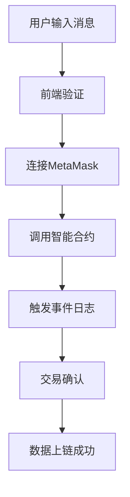

# 事件日志功能实现文档

## 概述

事件日志功能允许用户将文本消息记录到区块链上，通过智能合约的事件机制实现数据的永久存储和可查询性。

## 技术架构



## 实现步骤

### 第一步：智能合约设计

**合约文件**: `onchain-system-contracts/contracts/DataStorage.sol`

```solidity
// SPDX-License-Identifier: MIT
pragma solidity ^0.8.0;

contract DataStorage {
    // 定义事件，用于记录数据
    event DataStored(
        address indexed user,
        string message,
        uint256 timestamp
    );
    
    // 存储数据的函数
    function storeData(string memory _message) public {
        // 触发事件，将数据记录到区块链
        emit DataStored(msg.sender, _message, block.timestamp);
    }
}
```

**关键点解析**：
- `event DataStored`: 定义事件结构，包含用户地址、消息内容和时间戳
- `indexed`: 使用户地址可被索引，便于查询
- `msg.sender`: 自动记录调用者地址
- `block.timestamp`: 记录区块时间戳

### 第二步：前端组件实现

**组件文件**: `frontend/src/components/LogForm.tsx`

#### 2.1 导入依赖和基础设置

```typescript
import { useState } from "react";
import { ethers } from "ethers";
import DataStorageABI from "../abi/DataStorage.json";

// 合约地址（部署后获得）
const contractAddress = "0x41dCf4E34eB2C231Cb03663D6e47ff271f621C4A";
```

#### 2.2 状态管理

```typescript
export const LogForm = () => {
  // 表单状态
  const [message, setMessage] = useState("");
  
  // 交易状态管理
  const [txStatus, setTxStatus] = useState<"idle" | "pending" | "success" | "error">("idle");
  const [txHash, setTxHash] = useState("");
  const [errorMessage, setErrorMessage] = useState("");
```

**状态说明**：
- `message`: 用户输入的消息内容
- `txStatus`: 交易状态（空闲/处理中/成功/失败）
- `txHash`: 交易哈希值，用于链接到区块链浏览器
- `errorMessage`: 错误信息展示

#### 2.3 错误处理优化

```typescript
const getErrorMessage = (error: unknown): string => {
  if (error instanceof Error) {
    // 用户取消交易
    if (error.message.includes('rejected') || 
        error.message.includes('denied') || 
        error.message.includes('ACTION_REJECTED') ||
        error.message.includes('User denied')) {
      return "交易已取消";
    }
    
    // 余额不足
    if (error.message.includes('insufficient funds')) {
      return "余额不足，请确认账户有足够的ETH支付gas费用";
    }
    
    // 网络错误
    if (error.message.includes('network')) {
      return "网络连接异常，请检查网络状态";
    }
    
    // 合约执行错误
    if (error.message.includes('execution reverted')) {
      return "合约执行失败，请检查交易参数";
    }
    
    return error.message;
  }
  return String(error);
};
```

#### 2.4 核心交易处理逻辑

```typescript
const handleSubmit = async (e: React.FormEvent) => {
  e.preventDefault();
  
  // 1. 基础验证
  if (!message) {
    setErrorMessage("消息不能为空");
    return;
  }

  // 2. 检查 MetaMask 是否安装
  if (!window.ethereum) {
    setErrorMessage("请安装 MetaMask!");
    return;
  }

  try {
    setErrorMessage("");
    setTxStatus("pending");

    // 3. 连接钱包和合约
    const provider = new ethers.BrowserProvider(window.ethereum);
    const signer = await provider.getSigner();
    const contract = new ethers.Contract(contractAddress, DataStorageABI.abi, signer);

    // 4. 调用合约函数
    console.log("正在调用合约函数...");
    const tx = await contract.storeData(message);
    
    setTxHash(tx.hash);
    console.log("交易已发送, 哈希:", tx.hash);

    // 5. 等待交易确认
    await tx.wait();

    // 6. 更新状态为成功
    console.log("交易已确认!");
    setTxStatus("success");
    setMessage(""); // 清空输入框
  } catch (error) {
    console.error("交易失败:", error);
    setErrorMessage(getErrorMessage(error));
    setTxStatus("error");
  }
};
```

**处理流程解析**：
1. **表单验证**: 检查输入是否为空
2. **环境检查**: 确认MetaMask已安装
3. **建立连接**: 创建provider和signer
4. **合约调用**: 使用ethers.js调用合约的storeData函数
5. **等待确认**: 等待区块链确认交易
6. **状态更新**: 根据结果更新UI状态

### 第三步：用户界面设计

```typescript
return (
  <div className="form-container">
    <form onSubmit={handleSubmit}>
      <div className="form-group">
        <label htmlFor="message">输入要上链的日志消息:</label>
        <input
          id="message"
          type="text"
          value={message}
          onChange={(e) => setMessage(e.target.value)}
          placeholder="Hello, Blockchain!"
          disabled={txStatus === "pending"}
        />
      </div>
      <button type="submit" disabled={txStatus === "pending"}>
        {txStatus === "pending" ? "正在写入..." : "写入日志"}
      </button>
    </form>

    {/* 交易状态反馈 */}
    {txStatus === "pending" && (
      <div className="feedback">
        <p>交易发送中... 请在钱包中确认。</p>
        {txHash && (
          <p>
            交易哈希:{" "}
            <a
              href={`https://sepolia.etherscan.io/tx/${txHash}`}
              target="_blank"
              rel="noopener noreferrer"
            >
              {txHash}
            </a>
          </p>
        )}
      </div>
    )}

    {txStatus === "success" && (
      <div className="feedback success">
        <p>数据已成功写入区块链！</p>
        <p>
          查看交易:{" "}
          <a
            href={`https://sepolia.etherscan.io/tx/${txHash}`}
            target="_blank"
            rel="noopener noreferrer"
          >
            {txHash}
          </a>
        </p>
      </div>
    )}

    {txStatus === "error" && (
      <div className="feedback error">
        <p>写入失败。</p>
        <p>错误: {errorMessage}</p>
      </div>
    )}
  </div>
);
```

## 核心技术要点

### 1. ethers.js 集成
- **BrowserProvider**: 连接MetaMask提供的以太坊节点
- **Signer**: 获取用户签名权限
- **Contract**: 创建合约实例进行交互

### 2. 交易生命周期
1. **发起**: `contract.storeData(message)`
2. **签名**: 用户在MetaMask中确认
3. **广播**: 交易被发送到网络
4. **确认**: `tx.wait()` 等待打包确认

### 3. Gas费用处理
- 系统自动估算gas费用
- 用户可在MetaMask中调整gas设置
- 余额不足时给出友好提示

### 4. 错误处理机制
- **用户拒绝**: 显示"交易已取消"
- **余额不足**: 提示检查ETH余额
- **网络问题**: 建议检查网络连接
- **合约错误**: 提示检查参数

## 部署和配置

### 1. 智能合约部署
```bash
cd onchain-system-contracts
npx truffle migrate --network sepolia
```

### 2. ABI文件配置
部署完成后，将生成的ABI文件放置到：
```
frontend/src/abi/DataStorage.json
```

### 3. 合约地址配置
在LogForm.tsx中更新合约地址：
```typescript
const contractAddress = "你的合约地址";
```

## 测试流程

1. **连接钱包**: 确保MetaMask已连接到Sepolia测试网
2. **获取测试ETH**: 从Sepolia水龙头获取测试ETH
3. **输入消息**: 在表单中输入要记录的消息
4. **发送交易**: 点击"写入日志"按钮
5. **确认交易**: 在MetaMask中确认交易
6. **验证结果**: 通过交易哈希在Etherscan上查看结果

## 注意事项

1. **网络选择**: 确保前端和合约在同一网络（Sepolia）
2. **Gas费用**: 每次写入都需要消耗gas费用
3. **数据永久性**: 上链数据无法修改或删除
4. **字符限制**: 虽然理论上无限制，但过长消息会增加gas费用

## 扩展功能

1. **批量写入**: 一次交易写入多条消息
2. **分类标签**: 为消息添加分类标签
3. **权限控制**: 限制特定用户才能写入
4. **数据加密**: 对敏感消息进行加密存储