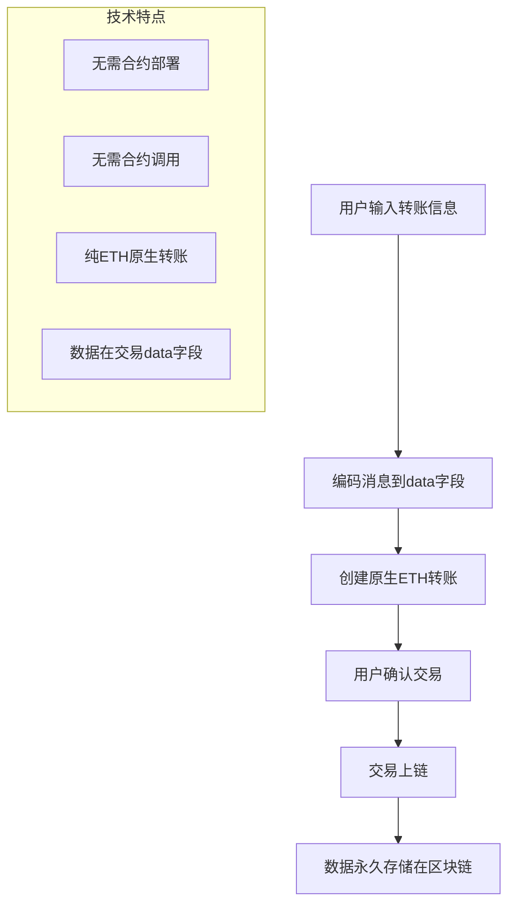

# 原生转账功能实现文档

## 概述

原生转账功能通过ETH原生转账的数据字段（data field）来存储信息。这种方法利用了以太坊交易本身的数据存储能力，无需部署智能合约、无需调用任何合约函数，仅使用最基础的ETH转账即可实现数据上链，是最简单直接的链上数据存储方式。

## 技术原理

每个以太坊交易都包含一个`data`字段，通常用于调用智能合约函数。原生转账功能利用这个字段在不调用合约的情况下携带自定义数据，实现最纯粹的链上数据存储。



## 实现步骤

### 第一步：数据编码方法

**核心概念**: 将文本消息转换为十六进制数据

```typescript
// 将UTF-8字符串编码为十六进制
const encodeMessage = (message: string): string => {
  return ethers.hexlify(ethers.toUtf8Bytes(message));
};

// 示例：
// 输入: "Hello, Blockchain!"
// 输出: "0x48656c6c6f2c20426c6f636b636861696e21"
```

**编码过程**：
1. 将字符串转换为UTF-8字节数组
2. 使用ethers.js的hexlify函数转换为十六进制
3. 结果可直接用作交易的data字段

### 第二步：前端组件实现

**组件文件**: `frontend/src/components/NativeTransferForm.tsx`

#### 2.1 状态管理和验证

```typescript
export const NativeTransferForm = () => {
  // 表单状态
  const [to, setTo] = useState('');           // 接收地址
  const [amount, setAmount] = useState('');   // 转账金额(ETH)
  const [message, setMessage] = useState(''); // 附加消息
  
  // 交易状态
  const [txStatus, setTxStatus] = useState<'idle' | 'pending' | 'success' | 'error'>('idle');
  const [txHash, setTxHash] = useState('');
  const [errorMessage, setErrorMessage] = useState('');
```

#### 2.2 地址验证函数

```typescript
const isValidAddress = (address: string): boolean => {
  try {
    // 使用ethers.js验证地址格式
    ethers.getAddress(address);
    return true;
  } catch {
    return false;
  }
};
```

**验证要点**：
- 检查地址长度（42字符，包含0x前缀）
- 验证十六进制格式
- 支持校验和格式（EIP-55）

#### 2.3 核心转账逻辑

```typescript
const handleSubmit = async (e: React.FormEvent) => {
  e.preventDefault();
  
  // 1. 输入验证
  if (!to || !amount || !message) {
    setErrorMessage('请填写所有字段');
    return;
  }
  
  if (!isValidAddress(to)) {
    setErrorMessage('请输入有效的以太坊地址');
    return;
  }
  
  if (isNaN(Number(amount)) || Number(amount) <= 0) {
    setErrorMessage('请输入有效的转账金额');
    return;
  }

  if (!window.ethereum) {
    setErrorMessage('请安装 MetaMask!');
    return;
  }

  try {
    setErrorMessage('');
    setTxStatus('pending');

    // 2. 连接钱包
    const provider = new ethers.BrowserProvider(window.ethereum);
    const signer = await provider.getSigner();

    // 3. 编码消息数据
    const messageData = ethers.hexlify(ethers.toUtf8Bytes(message));

    // 4. 构造原生转账交易对象
    const tx = {
      to: to,                                    // 接收地址
      value: ethers.parseEther(amount),          // 转账金额(wei)
      data: messageData                          // 附加数据(无合约调用)
    };

    console.log('发送交易:', tx);

    // 5. 发送交易
    const txResponse = await signer.sendTransaction(tx);
    setTxHash(txResponse.hash);
    
    console.log('交易已发送:', txResponse.hash);

    // 6. 等待确认
    await txResponse.wait();
    
    console.log('交易已确认!');
    setTxStatus('success');
    
    // 清空表单
    setTo('');
    setAmount('');
    setMessage('');
    
  } catch (error) {
    console.error('转账失败:', error);
    setErrorMessage(getErrorMessage(error));
    setTxStatus('error');
  }
};
```

**交易构造要点**：
- `to`: 接收方地址
- `value`: 转账金额，使用`parseEther`转换为wei单位
- `data`: 编码后的消息数据

### 第三步：交易数据解码

#### 3.1 从区块链读取数据

```typescript
// 获取交易详情
const getTransactionData = async (txHash: string) => {
  const provider = new ethers.JsonRpcProvider('https://sepolia.infura.io/v3/your-key');
  const tx = await provider.getTransaction(txHash);
  
  if (tx && tx.data && tx.data !== '0x') {
    // 解码附加数据
    const decodedMessage = ethers.toUtf8String(tx.data);
    console.log('解码消息:', decodedMessage);
  }
};
```

#### 3.2 批量查询历史交易

```typescript
// 查询用户的所有原生转账记录
const getUserTransferHistory = async (userAddress: string) => {
  const provider = new ethers.JsonRpcProvider('https://sepolia.infura.io/v3/your-key');
  
  // 获取最新区块号
  const latestBlock = await provider.getBlockNumber();
  
  // 查询最近1000个区块的交易
  for (let i = latestBlock; i > latestBlock - 1000; i--) {
    const block = await provider.getBlock(i, true);
    
    if (block && block.transactions) {
      for (const tx of block.transactions) {
        // 检查是否为用户发送的转账
        if (tx.from === userAddress && tx.data && tx.data !== '0x') {
          try {
            const message = ethers.toUtf8String(tx.data);
            console.log(`区块${i} 交易${tx.hash}: ${message}`);
          } catch (error) {
            // 数据可能不是UTF-8编码的文本
            console.log('无法解码数据:', tx.data);
          }
        }
      }
    }
  }
};
```

### 第四步：用户界面实现

```typescript
return (
  <div className="form-container">
    <form onSubmit={handleSubmit}>
      {/* 接收地址输入 */}
      <div className="form-group">
        <label htmlFor="to">接收地址:</label>
        <input
          id="to"
          type="text"
          value={to}
          onChange={(e) => setTo(e.target.value)}
          placeholder="0x742d35Cc6634C0532925a3b8D7389a9bf3be4D"
          disabled={txStatus === 'pending'}
        />
      </div>

      {/* 转账金额输入 */}
      <div className="form-group">
        <label htmlFor="amount">转账金额 (ETH):</label>
        <input
          id="amount"
          type="text"
          value={amount}
          onChange={(e) => setAmount(e.target.value)}
          placeholder="0.01"
          disabled={txStatus === 'pending'}
        />
      </div>

      {/* 附加消息输入 */}
      <div className="form-group">
        <label htmlFor="message">附加消息:</label>
        <input
          id="message"
          type="text"
          value={message}
          onChange={(e) => setMessage(e.target.value)}
          placeholder="Hello from blockchain transfer!"
          disabled={txStatus === 'pending'}
        />
      </div>

      <button type="submit" disabled={txStatus === 'pending'}>
        {txStatus === 'pending' ? '转账中...' : '发送转账'}
      </button>
    </form>

    {/* 状态反馈区域 */}
    {txStatus === 'pending' && (
      <div className="feedback">
        <p>转账处理中... 请在钱包中确认。</p>
        {txHash && (
          <p>
            交易哈希:{' '}
            <a
              href={`https://sepolia.etherscan.io/tx/${txHash}`}
              target="_blank"
              rel="noopener noreferrer"
            >
              {txHash}
            </a>
          </p>
        )}
      </div>
    )}

    {txStatus === 'success' && (
      <div className="feedback success">
        <p>转账成功！数据已写入区块链。</p>
        <p>
          查看交易:{' '}
          <a
            href={`https://sepolia.etherscan.io/tx/${txHash}`}
            target="_blank"
            rel="noopener noreferrer"
          >
            {txHash}
          </a>
        </p>
      </div>
    )}

    {txStatus === 'error' && (
      <div className="feedback error">
        <p>转账失败。</p>
        <p>错误: {errorMessage}</p>
      </div>
    )}
  </div>
);
```

## 技术特点

### 优势
1. **最简实现**: 无需合约，直接使用以太坊原生功能
2. **成本最低**: 只需支付基础转账gas费（约21,000 + data gas）
3. **直观易懂**: 纯转账行为，概念最简单
4. **兼容性佳**: 任何支持ETH的钱包和工具都能处理
5. **即时可用**: 无需等待合约部署，立即可使用

### 限制
1. **数据大小**: data字段越大，gas费越高
2. **查询复杂**: 需要遍历交易历史来查找数据
3. **必须转账**: 即使是少量ETH也需要实际转移
4. **解码要求**: 需要知道编码方式才能正确解读数据
5. **无结构化**: 数据只是字节流，无法进行复杂查询

## Gas费用分析

```typescript
// 基础转账: ~21,000 gas
// 每字节数据: ~68 gas (非零字节) 或 4 gas (零字节)

const estimateGasCost = (message: string) => {
  const baseGas = 21000;
  const messageBytes = ethers.toUtf8Bytes(message);
  
  let dataGas = 0;
  for (const byte of messageBytes) {
    dataGas += byte === 0 ? 4 : 68;
  }
  
  return baseGas + dataGas;
};

// 示例：消息"Hello, Blockchain!"需要约22,224 gas
```

## 数据持久性和查询

### 1. 区块链浏览器查询
- 在Etherscan中查看交易详情
- Input Data字段显示十六进制编码的消息
- 需要手动转换为可读文本

### 2. 程序化查询
```typescript
// 使用ethers.js查询特定交易
const provider = new ethers.JsonRpcProvider();
const tx = await provider.getTransaction(txHash);
const decodedMessage = ethers.toUtf8String(tx.data);
```

### 3. 事件监听（可选）
虽然这不是基于事件的方法，但可以监听转账交易：
```typescript
// 监听用户地址的所有转出交易
provider.on('block', async (blockNumber) => {
  const block = await provider.getBlock(blockNumber, true);
  // 处理区块中的交易...
});
```

## 最佳实践

1. **数据验证**: 发送前验证所有输入
2. **错误处理**: 友好的错误消息提示
3. **Gas优化**: 压缩消息长度以降低费用
4. **编码标准**: 统一使用UTF-8编码
5. **备份记录**: 本地保存重要交易哈希

## 扩展功能

1. **批量转账**: 一次交易发送给多个地址
2. **数据压缩**: 使用gzip等压缩算法
3. **元数据结构**: 定义JSON格式的数据结构
4. **索引服务**: 构建专门的数据查询服务