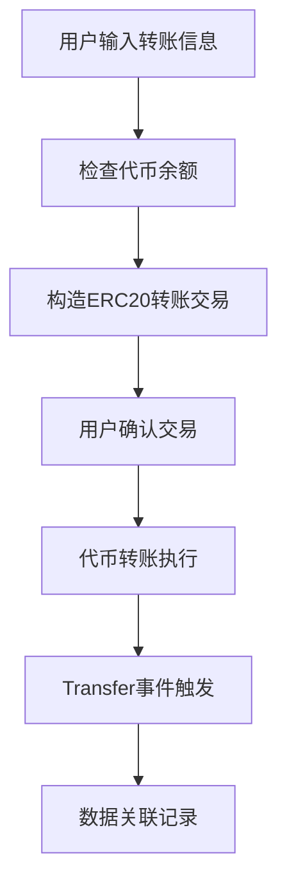

# 代币交易功能实现文档

## 概述

代币交易功能通过ERC20代币转账来记录数据。这种方法利用ERC20代币的转账机制，可以在转账的同时将数据信息关联到区块链交易中，实现数据记录和价值传递的结合。

## ERC20代币标准

ERC20是以太坊上最常用的代币标准，定义了代币合约必须实现的接口：

```solidity
interface IERC20 {
    function totalSupply() external view returns (uint256);
    function balanceOf(address account) external view returns (uint256);
    function transfer(address to, uint256 amount) external returns (bool);
    function allowance(address owner, address spender) external view returns (uint256);
    function approve(address spender, uint256 amount) external returns (bool);
    function transferFrom(address from, address to, uint256 amount) external returns (bool);
    
    event Transfer(address indexed from, address indexed to, uint256 value);
    event Approval(address indexed owner, address indexed spender, uint256 value);
}
```

## 技术架构



## 实现步骤

### 第一步：ERC20 ABI定义

**组件文件**: `frontend/src/components/TokenForm.tsx`

```typescript
// Sepolia测试网上的USDC合约地址
const usdcContractAddress = "0x1c7D4B196Cb0C7B01d743Fbc6116a902379C7238";

// ERC20标准转账函数的ABI定义
const erc20Abi = [
  {
    name: "transfer",
    type: "function", 
    stateMutability: "nonpayable",
    inputs: [
      { name: "to", type: "address" },
      { name: "amount", type: "uint256" },
    ],
    outputs: [{ name: "", type: "bool" }],
  },
  {
    name: "balanceOf",
    type: "function",
    stateMutability: "view", 
    inputs: [{ name: "account", type: "address" }],
    outputs: [{ name: "", type: "uint256" }],
  },
  {
    name: "decimals",
    type: "function",
    stateMutability: "view",
    inputs: [],
    outputs: [{ name: "", type: "uint8" }],
  }
];
```

**ABI解析**：
- `transfer`: 转账函数，将代币从调用者转移到指定地址
- `balanceOf`: 查询指定地址的代币余额
- `decimals`: 获取代币的小数位数（USDC为6位）

### 第二步：前端组件状态管理

```typescript
export const TokenForm = () => {
  // 表单状态
  const [to, setTo] = useState("");           // 接收地址
  const [amount, setAmount] = useState("");   // 转账数量
  const [message, setMessage] = useState(""); // 附加消息

  // 交易状态
  const [txStatus, setTxStatus] = useState<"idle" | "pending" | "success" | "error">("idle");
  const [txHash, setTxHash] = useState("");
  const [errorMessage, setErrorMessage] = useState("");

  // 余额信息
  const [userBalance, setUserBalance] = useState<string>("0");
```

### 第三步：余额查询功能

```typescript
const checkBalance = async (userAddress: string) => {
  try {
    const provider = new ethers.BrowserProvider(window.ethereum);
    const contract = new ethers.Contract(usdcContractAddress, erc20Abi, provider);
    
    // 查询用户USDC余额
    const balance = await contract.balanceOf(userAddress);
    
    // 转换为人类可读格式（USDC有6位小数）
    const formattedBalance = ethers.formatUnits(balance, 6);
    setUserBalance(formattedBalance);
    
    console.log(`用户USDC余额: ${formattedBalance}`);
  } catch (error) {
    console.error("查询余额失败:", error);
  }
};
```

**关键技术点**：
- `formatUnits(balance, 6)`: 将wei单位转换为USDC单位（6位小数）
- 实时显示用户余额，帮助用户确认是否有足够代币

### 第四步：核心转账逻辑

```typescript
const handleSubmit = async (e: React.FormEvent) => {
  e.preventDefault();
  
  // 1. 输入验证
  if (!to || !amount) {
    setErrorMessage("请填写接收地址和转账金额");
    return;
  }

  // 地址格式验证
  if (!ethers.isAddress(to)) {
    setErrorMessage("请输入有效的以太坊地址");
    return;
  }

  // 金额验证
  const amountNum = parseFloat(amount);
  if (isNaN(amountNum) || amountNum <= 0) {
    setErrorMessage("请输入有效的转账金额");
    return;
  }

  if (!window.ethereum) {
    setErrorMessage("请安装 MetaMask!");
    return;
  }

  try {
    setErrorMessage("");
    setTxStatus("pending");

    // 2. 连接钱包和合约
    const provider = new ethers.BrowserProvider(window.ethereum);
    const signer = await provider.getSigner();
    const contract = new ethers.Contract(usdcContractAddress, erc20Abi, signer);

    // 3. 转换金额到正确的单位
    // USDC使用6位小数，所以1 USDC = 1,000,000 最小单位
    const amountInWei = ethers.parseUnits(amount, 6);

    console.log("发送代币转账...");
    console.log("接收地址:", to);
    console.log("转账金额:", amount, "USDC");
    console.log("原始金额:", amountInWei.toString());

    // 4. 执行转账
    const tx = await contract.transfer(to, amountInWei);
    setTxHash(tx.hash);
    
    console.log("交易已发送:", tx.hash);

    // 5. 等待交易确认
    await tx.wait();
    
    console.log("交易已确认!");
    setTxStatus("success");
    
    // 清空表单
    setTo("");
    setAmount("");
    setMessage("");

    // 刷新余额
    const userAddress = await signer.getAddress();
    await checkBalance(userAddress);
    
  } catch (error) {
    console.error("交易失败:", error);
    setErrorMessage(getErrorMessage(error));
    setTxStatus("error");
  }
};
```

**执行流程详解**：
1. **输入验证**: 检查地址格式和金额有效性
2. **单位转换**: 使用`parseUnits(amount, 6)`将用户输入转换为合约期望的最小单位
3. **合约调用**: 调用ERC20合约的`transfer`函数
4. **交易确认**: 等待区块确认
5. **状态更新**: 更新UI并刷新余额

### 第五步：错误处理优化

```typescript
const getErrorMessage = (error: unknown): string => {
  if (error instanceof Error) {
    // 用户取消交易
    if (error.message.includes('rejected') || 
        error.message.includes('denied') || 
        error.message.includes('ACTION_REJECTED') ||
        error.message.includes('User denied')) {
      return "交易已取消";
    }
    
    // 余额不足（ETH）
    if (error.message.includes('insufficient funds')) {
      return "余额不足，请确认账户有足够的ETH支付gas费用";
    }
    
    // 代币余额不足
    if (error.message.includes('transfer amount exceeds balance')) {
      return "代币余额不足，请检查您的USDC余额";
    }
    
    // 网络错误
    if (error.message.includes('network')) {
      return "网络连接异常，请检查网络状态";
    }
    
    // 合约执行错误
    if (error.message.includes('execution reverted')) {
      return "合约执行失败，请检查交易参数";
    }
    
    return error.message;
  }
  return String(error);
};
```

**常见错误处理**：
- **代币余额不足**: 用户尝试转账超过其持有的代币数量
- **ETH余额不足**: 没有足够ETH支付gas费用
- **地址无效**: 接收地址格式错误
- **网络问题**: 连接异常或RPC错误

### 第六步：用户界面设计

```typescript
return (
  <div className="form-container">
    {/* 余额显示 */}
    <div className="balance-info">
      <p>当前USDC余额: <strong>{userBalance}</strong></p>
    </div>

    <form onSubmit={handleSubmit}>
      {/* 接收地址输入 */}
      <div className="form-group">
        <label htmlFor="token-to">接收地址:</label>
        <input
          id="token-to"
          type="text"
          value={to}
          onChange={(e) => setTo(e.target.value)}
          placeholder="0x742d35Cc6634C0532925a3b8D7389a9bf3be4D"
          disabled={txStatus === "pending"}
        />
      </div>

      {/* 转账金额输入 */}
      <div className="form-group">
        <label htmlFor="token-amount">转账金额 (USDC):</label>
        <input
          id="token-amount"
          type="text"
          value={amount}
          onChange={(e) => setAmount(e.target.value)}
          placeholder="10.0"
          disabled={txStatus === "pending"}
        />
      </div>

      {/* 附加消息（用于记录目的） */}
      <div className="form-group">
        <label htmlFor="token-message">备注信息:</label>
        <input
          id="token-message"
          type="text"
          value={message}
          onChange={(e) => setMessage(e.target.value)}
          placeholder="USDC代币转账备注"
          disabled={txStatus === "pending"}
        />
      </div>

      <button type="submit" disabled={txStatus === "pending"}>
        {txStatus === "pending" ? "转账中..." : "发送USDC"}
      </button>
    </form>

    {/* 交易状态反馈 */}
    {txStatus === "pending" && (
      <div className="feedback">
        <p>代币转账中... 请在钱包中确认。</p>
        {txHash && (
          <p>
            交易哈希:{" "}
            <a
              href={`https://sepolia.etherscan.io/tx/${txHash}`}
              target="_blank"
              rel="noopener noreferrer"
            >
              {txHash}
            </a>
          </p>
        )}
      </div>
    )}

    {txStatus === "success" && (
      <div className="feedback success">
        <p>USDC转账成功！</p>
        <p>
          查看交易:{" "}
          <a
            href={`https://sepolia.etherscan.io/tx/${txHash}`}
            target="_blank"
            rel="noopener noreferrer"
          >
            {txHash}
          </a>
        </p>
      </div>
    )}

    {txStatus === "error" && (
      <div className="feedback error">
        <p>转账失败。</p>
        <p>错误: {errorMessage}</p>
      </div>
    )}
  </div>
);
```

## 技术特点分析

### 优势
1. **标准化**: 基于广泛接受的ERC20标准
2. **可追溯**: 每笔转账都有明确的交易记录
3. **价值传递**: 同时实现数据记录和价值转移
4. **生态兼容**: 与所有支持ERC20的钱包和服务兼容

### 限制
1. **需要代币**: 必须持有足够的代币才能转账
2. **Gas费用**: 除了代币转账还需支付ETH作为gas费
3. **单一代币**: 每次只能使用一种代币类型
4. **精度限制**: 受代币小数位数限制

## 代币精度处理

不同代币有不同的小数位数：

```typescript
// 常见代币的小数位数
const TOKEN_DECIMALS = {
  USDC: 6,    // 1 USDC = 1,000,000 最小单位
  USDT: 6,    // 1 USDT = 1,000,000 最小单位  
  DAI: 18,    // 1 DAI = 1,000,000,000,000,000,000 最小单位
  WETH: 18,   // 1 WETH = 1,000,000,000,000,000,000 最小单位
};

// 动态获取代币精度
const getTokenDecimals = async (tokenAddress: string) => {
  const provider = new ethers.JsonRpcProvider();
  const contract = new ethers.Contract(tokenAddress, erc20Abi, provider);
  const decimals = await contract.decimals();
  return decimals;
};
```

## 交易监听和事件处理

```typescript
// 监听ERC20转账事件
const listenToTransferEvents = () => {
  const provider = new ethers.BrowserProvider(window.ethereum);
  const contract = new ethers.Contract(usdcContractAddress, erc20Abi, provider);

  // 监听Transfer事件
  contract.on("Transfer", (from, to, value, event) => {
    console.log("检测到转账:");
    console.log("发送方:", from);
    console.log("接收方:", to);
    console.log("金额:", ethers.formatUnits(value, 6), "USDC");
    console.log("交易哈希:", event.transactionHash);
  });
};

// 查询历史转账事件
const getTransferHistory = async (userAddress: string) => {
  const provider = new ethers.BrowserProvider(window.ethereum);
  const contract = new ethers.Contract(usdcContractAddress, erc20Abi, provider);

  // 创建过滤器
  const filter = contract.filters.Transfer(userAddress, null);
  
  // 查询最近1000个区块的事件
  const events = await contract.queryFilter(filter, -1000);
  
  events.forEach(event => {
    const { from, to, value } = event.args;
    console.log(`转账: ${ethers.formatUnits(value, 6)} USDC 从 ${from} 到 ${to}`);
  });
};
```

## Gas费用优化

```typescript
// 估算gas费用
const estimateGas = async (to: string, amount: string) => {
  const provider = new ethers.BrowserProvider(window.ethereum);
  const signer = await provider.getSigner();
  const contract = new ethers.Contract(usdcContractAddress, erc20Abi, signer);
  
  const amountInWei = ethers.parseUnits(amount, 6);
  
  try {
    const gasEstimate = await contract.transfer.estimateGas(to, amountInWei);
    console.log("预估gas用量:", gasEstimate.toString());
    return gasEstimate;
  } catch (error) {
    console.error("Gas估算失败:", error);
    throw error;
  }
};

// 设置自定义gas价格
const sendTransactionWithCustomGas = async (to: string, amount: string) => {
  const provider = new ethers.BrowserProvider(window.ethereum);
  const signer = await provider.getSigner();
  const contract = new ethers.Contract(usdcContractAddress, erc20Abi, signer);
  
  const amountInWei = ethers.parseUnits(amount, 6);
  
  // 获取当前gas价格
  const gasPrice = await provider.getFeeData();
  
  const tx = await contract.transfer(to, amountInWei, {
    gasLimit: 100000,                    // 设置gas限制
    gasPrice: gasPrice.gasPrice,         // 使用当前gas价格
  });
  
  return tx;
};
```

## 安全注意事项

1. **授权检查**: 确保合约有足够的授权额度
2. **余额验证**: 转账前检查代币余额
3. **地址验证**: 验证接收地址的有效性
4. **金额边界**: 检查转账金额的合理范围
5. **重放攻击**: 防止交易被重复执行

## 扩展功能

1. **多代币支持**: 支持切换不同的ERC20代币
2. **批量转账**: 一次交易转给多个地址
3. **定期转账**: 设置自动定期转账
4. **交易历史**: 本地存储交易历史
5. **汇率显示**: 显示代币的USD价值