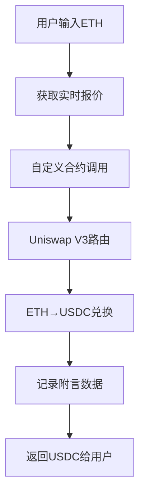

# 去中心化交易功能实现文档

## 概述

去中心化交易功能基于Uniswap V3协议实现，通过自定义智能合约将ETH兑换为USDC的同时记录附言数据。这种方法结合了DeFi交易和数据记录功能，实现了更复杂的链上操作。

## Uniswap V3架构

Uniswap V3是当前最先进的自动化做市商(AMM)协议，具有以下特点：
- **集中流动性**: 允许流动性提供者在特定价格区间内提供流动性
- **多重费用层级**: 支持0.01%、0.05%、0.30%和1%的交易费用
- **高效的价格发现**: 通过集中流动性实现更好的价格执行



## 智能合约实现

### 第一步：合约架构设计

**合约文件**: `onchain-system-contracts/contracts/SwapAndMemoV3.sol`

```solidity
// SPDX-License-Identifier: MIT
pragma solidity ^0.8.0;

import "@openzeppelin/contracts/security/ReentrancyGuard.sol";
import "@openzeppelin/contracts/access/Ownable.sol";
import "./interfaces/IUniswapV3Router.sol";

contract SwapAndMemoV3 is ReentrancyGuard, Ownable {
    // Uniswap V3路由合约地址
    IUniswapV3Router public constant uniswapRouter = 
        IUniswapV3Router(0xE592427A0AEce92De3Edee1F18E0157C05861564);
    
    // WETH合约地址（Sepolia测试网）
    address public constant WETH = 0x7b79995E5f793A07bC00C21412e50EaAE098e7F9;
    
    // 交易和备忘录事件
    event SwapWithMemo(
        address indexed user,
        uint256 amountIn,
        uint256 amountOut,
        address tokenOut,
        address indexed recipient,
        string memo,
        uint256 timestamp
    );

    /**
     * @dev 将ETH兑换为指定代币并记录备忘录
     * @param amountOutMinimum 最小输出代币数量（滑点保护）
     * @param tokenOut 输出代币地址
     * @param fee 交易费用层级（3000 = 0.3%）
     * @param recipient 代币接收地址
     * @param memo 备忘录内容
     */
    function swapEthForTokenWithMemoV3(
        uint256 amountOutMinimum,
        address tokenOut,
        uint24 fee,
        address recipient,
        string memory memo
    ) external payable nonReentrant {
        require(msg.value > 0, "Must send ETH");
        require(bytes(memo).length > 0, "Memo cannot be empty");
        
        // 构造Uniswap V3交换参数
        IUniswapV3Router.ExactInputSingleParams memory params = 
            IUniswapV3Router.ExactInputSingleParams({
                tokenIn: WETH,
                tokenOut: tokenOut,
                fee: fee,
                recipient: recipient,
                deadline: block.timestamp + 300, // 5分钟deadline
                amountIn: msg.value,
                amountOutMinimum: amountOutMinimum,
                sqrtPriceLimitX96: 0
            });
        
        // 执行交换
        uint256 amountOut = uniswapRouter.exactInputSingle{value: msg.value}(params);
        
        // 触发事件记录交易和备忘录
        emit SwapWithMemo(
            msg.sender,
            msg.value,
            amountOut,
            tokenOut,
            recipient,
            memo,
            block.timestamp
        );
    }
}
```

**合约关键点**：
- `ReentrancyGuard`: 防止重入攻击
- `exactInputSingleParams`: Uniswap V3的精确输入交换参数
- `SwapWithMemo事件`: 记录交换详情和附言数据
- `nonReentrant修饰符`: 确保函数执行安全性

### 第二步：前端价格查询系统

**组件文件**: `frontend/src/components/SwapFormV3.tsx`

#### 2.1 Quoter合约集成

```typescript
// Uniswap V3 Quoter合约地址（用于价格查询）
const quoterAddress = "0xEd1f6473345F45b75F8179591dd5bA1888cf2FB3";

// Quoter合约ABI（简化版）
const quoterAbi = [
  {
    name: "quoteExactInputSingle",
    type: "function",
    stateMutability: "view",
    inputs: [
      {
        name: "params",
        type: "tuple",
        components: [
          { name: "tokenIn", type: "address" },
          { name: "tokenOut", type: "address" },
          { name: "fee", type: "uint24" },
          { name: "amountIn", type: "uint256" },
          { name: "sqrtPriceLimitX96", type: "uint160" },
        ],
      },
    ],
    outputs: [
      { name: "amountOut", type: "uint256" },
      { name: "sqrtPriceX96After", type: "uint160" },
      { name: "initializedTicksCrossed", type: "uint32" },
      { name: "gasEstimate", type: "uint256" },
    ],
  },
];
```

#### 2.2 实时价格获取

```typescript
const [ethAmount, setEthAmount] = useState("");
const [quote, setQuote] = useState("");
const [isQuoting, setIsQuoting] = useState(false);

// 实时获取兑换报价
useEffect(() => {
  const getQuote = async () => {
    if (
      !ethAmount ||
      isNaN(Number(ethAmount)) ||
      Number(ethAmount) <= 0 ||
      !window.ethereum
    ) {
      setQuote("");
      return;
    }
    
    setIsQuoting(true);
    
    try {
      const provider = new ethers.BrowserProvider(window.ethereum);
      const quoter = new ethers.Contract(quoterAddress, quoterAbi, provider);

      const amountIn = ethers.parseEther(ethAmount);
      
      // 构造查询参数
      const params = {
        tokenIn: WETHAddress,                    // WETH地址
        tokenOut: usdcContractAddress,           // USDC地址  
        fee: 3000,                               // 0.3%费用层级
        amountIn: amountIn,
        sqrtPriceLimitX96: 0,                    // 无价格限制
      };

      // 调用Quoter获取价格
      const result = await quoter.quoteExactInputSingle.staticCall(params);
      const amountOutBigInt = result[0];
      
      // 格式化USDC输出（6位小数）
      const amountOut = ethers.formatUnits(amountOutBigInt, 6);
      setQuote(amountOut);
      
    } catch (err) {
      console.error("Failed to get quote:", err);
      setQuote("获取报价失败 (可能流动性不足)");
    }
    
    setIsQuoting(false);
  };

  // 防抖处理，避免频繁查询
  const debounce = setTimeout(getQuote, 500);
  return () => clearTimeout(debounce);
}, [ethAmount]);
```

**价格查询机制**：
- **实时更新**: 用户输入金额时自动获取报价
- **防抖处理**: 500ms延迟避免过度查询
- **错误处理**: 处理流动性不足等异常情况
- **格式化显示**: 将wei转换为可读的USDC数量

### 第三步：交易执行逻辑

```typescript
const handleSubmit = async (e: React.FormEvent) => {
  e.preventDefault();
  
  // 1. 输入验证
  if (!ethAmount || !recipient || !message || !quote || quote.includes("失败")) {
    setErrorMessage("请填写所有字段并获取有效报价");
    return;
  }
  
  if (!window.ethereum) {
    setErrorMessage("请安装 MetaMask!");
    return;
  }

  try {
    setErrorMessage("");
    setTxStatus("pending");

    // 2. 连接钱包和合约
    const provider = new ethers.BrowserProvider(window.ethereum);
    const signer = await provider.getSigner();
    const swapContract = new ethers.Contract(
      swapContractAddress,
      SwapAndMemoV3ABI.abi,
      signer
    );

    // 3. 计算滑点保护（允许1%滑点）
    const amountOutMin = ethers.parseUnits(
      (parseFloat(quote) * 0.99).toFixed(6),
      6
    );
    
    const amountIn = ethers.parseEther(ethAmount);
    const fee = 3000; // 0.3%费用层级

    console.log("执行兑换...");
    console.log("输入ETH:", ethAmount);
    console.log("预期USDC:", quote);
    console.log("最小输出:", ethers.formatUnits(amountOutMin, 6));

    // 4. 调用合约函数
    const tx = await swapContract.swapEthForTokenWithMemoV3(
      amountOutMin,           // 最小输出数量
      usdcContractAddress,    // 输出代币地址
      fee,                    // 费用层级
      recipient,              // 接收地址
      message,                // 附言内容
      { value: amountIn }     // 发送的ETH数量
    );

    setTxHash(tx.hash);
    console.log("交易已发送:", tx.hash);

    // 5. 等待确认
    await tx.wait();
    
    console.log("交易已确认!");
    setTxStatus("success");
    
    // 清空表单
    setEthAmount("");
    setRecipient("");
    setMessage("");
    setQuote("");
    
  } catch (error: unknown) {
    const getErrorMessage = (error: unknown): string => {
      if (error instanceof Error) {
        // 用户取消交易
        if (error.message.includes('rejected') || 
            error.message.includes('denied') || 
            error.message.includes('ACTION_REJECTED') ||
            error.message.includes('User denied')) {
          return "交易已取消";
        }
        
        // 余额不足
        if (error.message.includes('insufficient funds')) {
          return "余额不足，请确认账户有足够的ETH支付交易";
        }
        
        // 滑点过大
        if (error.message.includes('Too little received') || 
            error.message.includes('INSUFFICIENT_OUTPUT_AMOUNT')) {
          return "滑点过大，请重新获取报价后再试";
        }
        
        // 流动性不足
        if (error.message.includes('STF')) {
          return "流动性不足，请减少交易金额";
        }
        
        // 网络错误
        if (error.message.includes('network')) {
          return "网络连接异常，请检查网络状态";
        }
        
        return error.message;
      }
      return "交易失败";
    };
    
    setErrorMessage(getErrorMessage(error));
    setTxStatus("error");
  }
};
```

### 第四步：用户界面实现

```typescript
return (
  <div className="form-container">
    <form onSubmit={handleSubmit}>
      {/* ETH输入金额 */}
      <div className="form-group">
        <label htmlFor="eth-amount">支付金额 (ETH):</label>
        <input
          id="eth-amount"
          type="text"
          value={ethAmount}
          onChange={(e) => setEthAmount(e.target.value)}
          placeholder="0.01"
        />
        {/* 实时报价显示 */}
        {isQuoting && <small>正在获取报价...</small>}
        {quote && (
          <small>
            大约收到: {parseFloat(quote).toFixed(4)} USDC
          </small>
        )}
      </div>
      
      {/* 接收地址 */}
      <div className="form-group">
        <label htmlFor="swap-recipient">收款人地址:</label>
        <input
          id="swap-recipient"
          type="text"
          value={recipient}
          onChange={(e) => setRecipient(e.target.value)}
          placeholder="0x..."
        />
      </div>
      
      {/* 附言内容 */}
      <div className="form-group">
        <label htmlFor="swap-message">附言:</label>
        <input
          id="swap-message"
          type="text"
          value={message}
          onChange={(e) => setMessage(e.target.value)}
          placeholder="Swap and Memo via V3"
        />
      </div>
      
      <button type="submit" disabled={txStatus === "pending" || isQuoting}>
        {isQuoting
          ? "等待报价..."
          : txStatus === "pending"
          ? "正在处理..."
          : "兑换并记录"}
      </button>
    </form>

    {/* 状态反馈 */}
    {txStatus === "pending" && (
      <div className="feedback">
        <p>交易发送中... 请在钱包中确认。</p>
        {txHash && (
          <p>
            交易哈希:{" "}
            <a
              href={`https://sepolia.etherscan.io/tx/${txHash}`}
              target="_blank"
              rel="noopener noreferrer"
            >
              {txHash}
            </a>
          </p>
        )}
      </div>
    )}

    {txStatus === "success" && (
      <div className="feedback success">
        <p>兑换成功！</p>
        <p>
          交易哈希:{" "}
          <a
            href={`https://sepolia.etherscan.io/tx/${txHash}`}
            target="_blank"
            rel="noopener noreferrer"
          >
            {txHash}
          </a>
        </p>
      </div>
    )}

    {txStatus === "error" && (
      <div className="feedback error">
        <p>兑换失败。</p>
        <p>错误: {errorMessage}</p>
      </div>
    )}
  </div>
);
```

## 核心技术要点

### 1. Uniswap V3集成

**路由器合约**:
- `IUniswapV3Router`: 处理代币交换的核心合约
- `exactInputSingle`: 使用精确输入金额进行单一代币对交换

**价格查询**:
- `IQuoter`: 用于获取实时价格报价，不执行实际交易
- `quoteExactInputSingle`: 模拟交换获取预期输出

### 2. 滑点保护机制

```typescript
// 计算滑点保护（1%容忍度）
const slippageTolerance = 0.01; // 1%
const amountOutMin = ethers.parseUnits(
  (parseFloat(quote) * (1 - slippageTolerance)).toFixed(6),
  6
);
```

**滑点原理**:
- **市场波动**: 交易执行时价格可能发生变化
- **流动性变化**: 大额交易可能影响价格
- **保护措施**: 设置最小输出量，低于此值交易失败

### 3. 费用层级选择

Uniswap V3支持多种费用层级：

```typescript
const FEE_TIERS = {
  LOW: 500,      // 0.05% - 稳定币对
  MEDIUM: 3000,  // 0.30% - 大多数对
  HIGH: 10000,   // 1.00% - 稀有对
};

// 根据交易对选择合适费用
const selectOptimalFee = (tokenA: string, tokenB: string) => {
  // 稳定币对使用低费用
  if (isStablePair(tokenA, tokenB)) return FEE_TIERS.LOW;
  
  // 主流币对使用中等费用  
  if (isMainPair(tokenA, tokenB)) return FEE_TIERS.MEDIUM;
  
  // 其他使用高费用
  return FEE_TIERS.HIGH;
};
```

### 4. Gas优化策略

```typescript
// 批量操作减少gas消耗
const batchSwapWithMemo = async (swaps: SwapParams[]) => {
  const multicallData = swaps.map(swap => 
    swapContract.interface.encodeFunctionData(
      "swapEthForTokenWithMemoV3",
      [swap.amountOutMinimum, swap.tokenOut, swap.fee, swap.recipient, swap.memo]
    )
  );
  
  // 使用multicall执行批量交易
  await swapContract.multicall(multicallData);
};
```

## 部署和配置

### 1. 合约部署

```javascript
// migrations/2_deploy_swap_v3_contract.js
const SwapAndMemoV3 = artifacts.require("SwapAndMemoV3");

module.exports = function (deployer) {
  deployer.deploy(SwapAndMemoV3);
};
```

### 2. ABI配置

```bash
# 编译合约
npx truffle compile

# 部署到Sepolia测试网
npx truffle migrate --network sepolia

# 复制ABI文件到前端
cp build/contracts/SwapAndMemoV3.json frontend/src/abi/
```

### 3. 环境变量配置

```typescript
// 配置合约地址
const swapContractAddress = "0x1f5423d29193b95Fd09233C2dfB3879C981a14a4";
const usdcContractAddress = "0x1c7D4B196Cb0C7B01d743Fbc6116a902379C7238";
const WETHAddress = "0x7b79995E5f793A07bC00C21412e50EaAE098e7F9";
const quoterAddress = "0xEd1f6473345F45b75F8179591dd5bA1888cf2FB3";
```

## 风险管理

### 1. MEV保护

```solidity
// 在合约中加入MEV保护
modifier protectFromMEV() {
    require(tx.gasprice <= block.basefee + maxPriorityFeePerGas, "MEV detected");
    _;
}
```

### 2. 最大交易限制

```solidity
uint256 public maxTradeAmount = 10 ether; // 最大单笔交易

modifier validTradeAmount(uint256 amount) {
    require(amount <= maxTradeAmount, "Trade amount too large");
    _;
}
```

### 3. 紧急暂停功能

```solidity
bool public paused = false;

modifier whenNotPaused() {
    require(!paused, "Contract is paused");
    _;
}

function pause() external onlyOwner {
    paused = true;
}
```

## 监控和分析

### 1. 事件监听

```typescript
// 监听SwapWithMemo事件
const listenToSwapEvents = () => {
  const contract = new ethers.Contract(swapContractAddress, abi, provider);
  
  contract.on("SwapWithMemo", (user, amountIn, amountOut, tokenOut, recipient, memo, timestamp, event) => {
    console.log("新的兑换记录:");
    console.log("用户:", user);
    console.log("输入ETH:", ethers.formatEther(amountIn));
    console.log("输出USDC:", ethers.formatUnits(amountOut, 6));
    console.log("附言:", memo);
    console.log("交易哈希:", event.transactionHash);
  });
};
```

### 2. 数据分析

```typescript
// 统计交易数据
const analyzeSwapData = async () => {
  const contract = new ethers.Contract(swapContractAddress, abi, provider);
  const filter = contract.filters.SwapWithMemo();
  const events = await contract.queryFilter(filter);
  
  const stats = {
    totalTrades: events.length,
    totalVolume: events.reduce((sum, event) => sum + Number(ethers.formatEther(event.args.amountIn)), 0),
    avgTradeSize: 0,
    uniqueUsers: new Set(events.map(event => event.args.user)).size
  };
  
  stats.avgTradeSize = stats.totalVolume / stats.totalTrades;
  
  console.log("交易统计:", stats);
};
```

## 扩展功能

1. **多代币支持**: 支持ETH兑换为多种代币
2. **路径优化**: 自动寻找最优交换路径
3. **定价策略**: 集成多个价格源进行比较
4. **流动性挖矿**: 结合流动性奖励机制
5. **跨链桥接**: 支持跨链资产交换

## 测试策略

1. **单元测试**: 测试合约的各个函数
2. **集成测试**: 测试与Uniswap的集成
3. **压力测试**: 测试高并发和大额交易
4. **安全审计**: 第三方安全审计

这种去中心化交易功能展示了如何将复杂的DeFi操作与数据记录结合，创造更有价值的区块链应用。