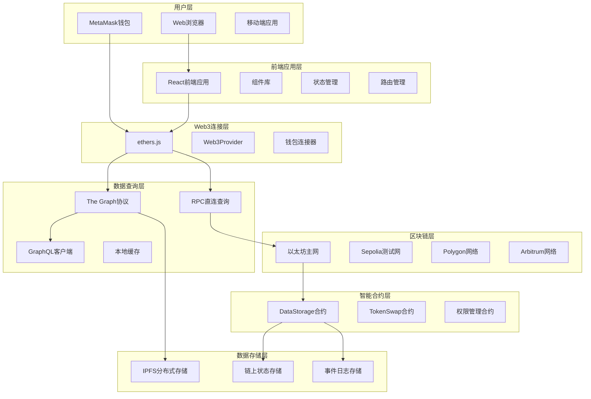

# 链上数据系统技术架构说明

## 架构总览

链上数据系统采用现代化的Web3技术栈，结合去中心化存储、智能合约和前端技术，构建了一个完整的去中心化数据平台。系统架构遵循模块化、可扩展和高性能的设计原则。



## 系统分层架构

### 1. 用户交互层 (User Interface Layer)

**责任**: 提供用户友好的操作界面和交互体验

**核心组件**:
- **Web浏览器界面**: 基于React的现代化SPA应用
- **钱包集成**: MetaMask等Web3钱包的无缝集成
- **响应式设计**: 支持桌面端和移动端适配
- **实时状态反馈**: 交易状态和连接状态的实时显示

**技术实现**:
```typescript
// 主应用组件架构
const App = () => {
  return (
    <BrowserRouter>
      <WalletProvider>
        <ThemeProvider>
          <Routes>
            <Route path="/" element={<HomePage />} />
            <Route path="/data" element={<DataPage />} />
            <Route path="/upload" element={<UploadPage />} />
          </Routes>
        </ThemeProvider>
      </WalletProvider>
    </BrowserRouter>
  );
};
```

### 2. 应用逻辑层 (Application Logic Layer)

**责任**: 处理业务逻辑、状态管理和用户交互

**架构模式**: React Hooks + Context API

```typescript
// 全局状态管理架构
interface AppState {
  wallet: WalletState;
  network: NetworkState;
  data: DataState;
  ui: UIState;
}

// 钱包状态管理
const WalletContext = createContext<WalletContextType>(null);

export const useWallet = () => {
  const context = useContext(WalletContext);
  if (!context) {
    throw new Error('useWallet must be used within WalletProvider');
  }
  return context;
};
```

**核心功能模块**:

#### 2.1 钱包管理模块
```typescript
class WalletManager {
  private provider: BrowserProvider | null = null;
  private signer: Signer | null = null;
  
  async connect(): Promise<string> {
    // 连接钱包逻辑
  }
  
  async switchNetwork(chainId: number): Promise<void> {
    // 网络切换逻辑
  }
  
  async getBalance(): Promise<string> {
    // 余额查询逻辑
  }
}
```

#### 2.2 合约交互模块
```typescript
class ContractManager {
  private contracts: Map<string, Contract> = new Map();
  
  getContract(address: string, abi: any): Contract {
    // 合约实例管理
  }
  
  async executeTransaction(
    contract: Contract,
    method: string,
    params: any[]
  ): Promise<TransactionResponse> {
    // 统一的合约调用接口
  }
}
```

#### 2.3 数据管理模块
```typescript
class DataManager {
  async storeData(data: DataItem): Promise<string> {
    // 数据上链逻辑
  }
  
  async queryData(filters: QueryFilters): Promise<DataItem[]> {
    // 数据查询逻辑
  }
  
  async subscribeToUpdates(callback: UpdateCallback): Promise<void> {
    // 实时数据订阅
  }
}
```

### 3. Web3集成层 (Web3 Integration Layer)

**责任**: 处理与区块链的所有交互，包括钱包连接、交易发送、数据查询等

**核心库**: ethers.js v6

```typescript
// Web3Provider配置
class Web3Service {
  private provider: BrowserProvider;
  private networkConfig: NetworkConfig;
  
  constructor() {
    this.provider = new ethers.BrowserProvider(window.ethereum);
    this.setupEventListeners();
  }
  
  private setupEventListeners() {
    // 监听账户变更
    window.ethereum?.on('accountsChanged', this.handleAccountsChanged);
    // 监听网络变更
    window.ethereum?.on('chainChanged', this.handleChainChanged);
    // 监听连接状态
    window.ethereum?.on('connect', this.handleConnect);
    window.ethereum?.on('disconnect', this.handleDisconnect);
  }
}
```

**网络配置管理**:
```typescript
interface NetworkConfig {
  chainId: number;
  name: string;
  rpcUrl: string;
  blockExplorer: string;
  nativeCurrency: {
    name: string;
    symbol: string;
    decimals: number;
  };
}

const SUPPORTED_NETWORKS: Record<number, NetworkConfig> = {
  1: {
    chainId: 1,
    name: 'Ethereum Mainnet',
    rpcUrl: 'https://mainnet.infura.io/v3/YOUR_KEY',
    blockExplorer: 'https://etherscan.io',
    nativeCurrency: { name: 'Ether', symbol: 'ETH', decimals: 18 }
  },
  11155111: {
    chainId: 11155111,
    name: 'Sepolia Testnet',
    rpcUrl: 'https://sepolia.infura.io/v3/YOUR_KEY',
    blockExplorer: 'https://sepolia.etherscan.io',
    nativeCurrency: { name: 'Sepolia Ether', symbol: 'ETH', decimals: 18 }
  }
};
```

### 4. 数据查询层 (Data Query Layer)

**责任**: 提供高效、可靠的数据查询服务

**多数据源架构**:
```typescript
interface DataSource {
  name: string;
  priority: number;
  query(params: QueryParams): Promise<QueryResult>;
  isAvailable(): Promise<boolean>;
}

class QueryManager {
  private dataSources: DataSource[] = [
    new TheGraphDataSource(),
    new DirectRPCDataSource(),
    new CacheDataSource()
  ];
  
  async query(params: QueryParams): Promise<QueryResult> {
    // 按优先级尝试不同数据源
    for (const source of this.dataSources.sort((a, b) => a.priority - b.priority)) {
      if (await source.isAvailable()) {
        try {
          return await source.query(params);
        } catch (error) {
          console.warn(`Data source ${source.name} failed:`, error);
        }
      }
    }
    throw new Error('All data sources unavailable');
  }
}
```

#### 4.1 The Graph集成
```typescript
class TheGraphDataSource implements DataSource {
  private endpoint: string;
  private client: ApolloClient<NormalizedCacheObject>;
  
  constructor(endpoint: string) {
    this.endpoint = endpoint;
    this.client = new ApolloClient({
      uri: endpoint,
      cache: new InMemoryCache(),
      defaultOptions: {
        watchQuery: { errorPolicy: 'all' },
        query: { errorPolicy: 'all' }
      }
    });
  }
  
  async query(params: QueryParams): Promise<QueryResult> {
    const query = this.buildGraphQLQuery(params);
    const result = await this.client.query({ query });
    return this.transformResult(result.data);
  }
}
```

#### 4.2 直接RPC查询
```typescript
class DirectRPCDataSource implements DataSource {
  private provider: JsonRpcProvider;
  
  async query(params: QueryParams): Promise<QueryResult> {
    const filter = this.buildEventFilter(params);
    const events = await this.contract.queryFilter(
      filter,
      params.fromBlock,
      params.toBlock
    );
    
    return this.processEvents(events);
  }
  
  private buildEventFilter(params: QueryParams) {
    // 构建事件过滤器
    if (params.userAddress) {
      return this.contract.filters.DataStored(params.userAddress);
    }
    return this.contract.filters.DataStored();
  }
}
```

### 5. 智能合约层 (Smart Contract Layer)

**责任**: 处理链上数据存储、验证和访问控制

#### 5.1 数据存储合约架构
```solidity
// contracts/DataStorage.sol
contract DataStorage is Ownable, Pausable, ReentrancyGuard {
    using Counters for Counters.Counter;
    
    // 数据结构定义
    struct DataRecord {
        uint256 id;
        address user;
        string contentHash;
        uint256 timestamp;
        uint256 blockNumber;
        bool encrypted;
    }
    
    // 状态变量
    Counters.Counter private _dataIdCounter;
    mapping(uint256 => DataRecord) private _dataRecords;
    mapping(address => uint256[]) private _userDataIds;
    
    // 事件定义
    event DataStored(
        uint256 indexed dataId,
        address indexed user,
        string indexed contentHash,
        uint256 timestamp
    );
    
    event DataUpdated(
        uint256 indexed dataId,
        address indexed user,
        string newContentHash
    );
    
    // 存储数据函数
    function storeData(
        string memory contentHash,
        bool encrypted
    ) external nonReentrant whenNotPaused returns (uint256) {
        uint256 dataId = _dataIdCounter.current();
        _dataIdCounter.increment();
        
        DataRecord storage record = _dataRecords[dataId];
        record.id = dataId;
        record.user = msg.sender;
        record.contentHash = contentHash;
        record.timestamp = block.timestamp;
        record.blockNumber = block.number;
        record.encrypted = encrypted;
        
        _userDataIds[msg.sender].push(dataId);
        
        emit DataStored(dataId, msg.sender, contentHash, block.timestamp);
        
        return dataId;
    }
}
```

#### 5.2 权限管理合约
```solidity
// contracts/AccessControl.sol
contract AccessControl is Ownable {
    mapping(address => mapping(string => bool)) private _permissions;
    mapping(string => address[]) private _roleUsers;
    
    modifier hasPermission(string memory permission) {
        require(_permissions[msg.sender][permission], "Access denied");
        _;
    }
    
    function grantPermission(
        address user,
        string memory permission
    ) external onlyOwner {
        _permissions[user][permission] = true;
        _roleUsers[permission].push(user);
    }
    
    function revokePermission(
        address user,
        string memory permission
    ) external onlyOwner {
        _permissions[user][permission] = false;
    }
}
```

#### 5.3 代币经济模型
```solidity
// contracts/DataToken.sol
contract DataToken is ERC20, Ownable {
    uint256 public constant STORAGE_REWARD = 10 * 10**18; // 10 tokens
    uint256 public constant QUERY_COST = 1 * 10**18;     // 1 token
    
    mapping(address => uint256) public userStorageCount;
    mapping(address => uint256) public userQueryCount;
    
    function rewardStorage(address user) external onlyOwner {
        _mint(user, STORAGE_REWARD);
        userStorageCount[user]++;
    }
    
    function chargeQuery(address user) external onlyOwner {
        require(balanceOf(user) >= QUERY_COST, "Insufficient balance");
        _burn(user, QUERY_COST);
        userQueryCount[user]++;
    }
}
```

### 6. 数据存储层 (Data Storage Layer)

**责任**: 管理不同类型的数据存储需求

#### 6.1 链上存储策略
```typescript
enum StorageType {
  EVENT_LOGS = 'event_logs',        // 事件日志存储
  STATE_VARIABLES = 'state_vars',   // 状态变量存储
  TRANSACTION_DATA = 'tx_data',     // 交易数据字段
  IPFS_HASH = 'ipfs_hash'          // IPFS哈希存储
}

class StorageManager {
  async store(data: any, type: StorageType): Promise<string> {
    switch (type) {
      case StorageType.EVENT_LOGS:
        return this.storeAsEvent(data);
      case StorageType.STATE_VARIABLES:
        return this.storeAsState(data);
      case StorageType.TRANSACTION_DATA:
        return this.storeInTransaction(data);
      case StorageType.IPFS_HASH:
        return this.storeInIPFS(data);
    }
  }
}
```

#### 6.2 IPFS集成
```typescript
class IPFSManager {
  private ipfs: IPFS;
  
  constructor() {
    this.ipfs = create({
      host: 'ipfs.infura.io',
      port: 5001,
      protocol: 'https'
    });
  }
  
  async upload(data: Buffer): Promise<string> {
    const result = await this.ipfs.add(data);
    return result.cid.toString();
  }
  
  async download(hash: string): Promise<Buffer> {
    const chunks = [];
    for await (const chunk of this.ipfs.cat(hash)) {
      chunks.push(chunk);
    }
    return Buffer.concat(chunks);
  }
  
  async pin(hash: string): Promise<void> {
    await this.ipfs.pin.add(hash);
  }
}
```

## 性能优化架构

### 1. 前端性能优化

#### 1.1 代码分割与懒加载
```typescript
// 路由级别代码分割
const HomePage = lazy(() => import('../pages/HomePage'));
const DataPage = lazy(() => import('../pages/DataPage'));
const UploadPage = lazy(() => import('../pages/UploadPage'));

// 组件级别懒加载
const DataChart = lazy(() => import('../components/DataChart'));
```

#### 1.2 虚拟滚动优化
```typescript
// 大列表虚拟滚动
import { FixedSizeList as List } from 'react-window';

const VirtualizedDataList = ({ items }: { items: DataItem[] }) => {
  const Row = ({ index, style }: { index: number; style: CSSProperties }) => (
    <div style={style}>
      <DataRow item={items[index]} />
    </div>
  );

  return (
    <List
      height={600}
      itemCount={items.length}
      itemSize={80}
      overscanCount={5}
    >
      {Row}
    </List>
  );
};
```

#### 1.3 状态管理优化
```typescript
// 使用React Query进行数据缓存
const useDataQuery = (params: QueryParams) => {
  return useQuery(
    ['data', params],
    () => fetchData(params),
    {
      staleTime: 5 * 60 * 1000,      // 5分钟内数据新鲜
      cacheTime: 10 * 60 * 1000,     // 10分钟缓存时间
      refetchOnWindowFocus: false,   // 窗口聚焦时不重新获取
      retry: 3,                      // 失败重试3次
    }
  );
};
```

### 2. 区块链交互优化

#### 2.1 批量查询优化
```typescript
class BatchQueryManager {
  private queryQueue: QueryRequest[] = [];
  private batchSize = 10;
  
  async addQuery(request: QueryRequest): Promise<any> {
    return new Promise((resolve, reject) => {
      this.queryQueue.push({ ...request, resolve, reject });
      this.processBatch();
    });
  }
  
  private async processBatch() {
    if (this.queryQueue.length >= this.batchSize) {
      const batch = this.queryQueue.splice(0, this.batchSize);
      await this.executeBatch(batch);
    }
  }
}
```

#### 2.2 Gas优化策略
```typescript
class GasOptimizer {
  async estimateOptimalGasPrice(): Promise<bigint> {
    const feeData = await this.provider.getFeeData();
    const networkCongestion = await this.getNetworkCongestion();
    
    // 根据网络拥堵情况调整Gas价格
    if (networkCongestion > 0.8) {
      return feeData.gasPrice! * 120n / 100n; // 增加20%
    } else if (networkCongestion < 0.3) {
      return feeData.gasPrice! * 90n / 100n;  // 减少10%
    }
    
    return feeData.gasPrice!;
  }
  
  async batchTransactions(txs: TransactionRequest[]): Promise<string[]> {
    // 批量打包交易以节省Gas
    const multicallContract = new Contract(MULTICALL_ADDRESS, MULTICALL_ABI, this.signer);
    const calls = txs.map(tx => ({ target: tx.to, callData: tx.data }));
    
    const result = await multicallContract.aggregate(calls);
    return result.returnData;
  }
}
```

### 3. 缓存架构

#### 3.1 多级缓存策略
```typescript
class CacheManager {
  private memoryCache = new Map<string, CacheEntry>();
  private indexedDBCache: IDBDatabase;
  
  async get(key: string): Promise<any> {
    // Level 1: 内存缓存
    const memoryResult = this.memoryCache.get(key);
    if (memoryResult && !this.isExpired(memoryResult)) {
      return memoryResult.data;
    }
    
    // Level 2: IndexedDB缓存
    const dbResult = await this.getFromIndexedDB(key);
    if (dbResult && !this.isExpired(dbResult)) {
      // 回写到内存缓存
      this.memoryCache.set(key, dbResult);
      return dbResult.data;
    }
    
    return null;
  }
  
  async set(key: string, data: any, ttl: number): Promise<void> {
    const entry = {
      data,
      timestamp: Date.now(),
      ttl
    };
    
    // 同时写入内存和IndexedDB
    this.memoryCache.set(key, entry);
    await this.setToIndexedDB(key, entry);
  }
}
```

#### 3.2 智能缓存失效
```typescript
class SmartCacheInvalidation {
  private dependencies = new Map<string, Set<string>>();
  
  addDependency(cacheKey: string, dependency: string): void {
    if (!this.dependencies.has(dependency)) {
      this.dependencies.set(dependency, new Set());
    }
    this.dependencies.get(dependency)!.add(cacheKey);
  }
  
  invalidate(trigger: string): void {
    const dependentKeys = this.dependencies.get(trigger);
    if (dependentKeys) {
      dependentKeys.forEach(key => {
        this.cacheManager.delete(key);
      });
    }
  }
  
  // 监听区块链事件自动失效缓存
  setupAutoInvalidation(): void {
    this.contract.on('DataStored', (user: string) => {
      this.invalidate(`user_data_${user}`);
      this.invalidate('all_data');
    });
  }
}
```

## 安全架构

### 1. 智能合约安全

#### 1.1 安全模式实现
```solidity
contract SecurityModule is Pausable, ReentrancyGuard {
    // 紧急暂停机制
    modifier whenNotPaused() override {
        require(!paused() || msg.sender == owner(), "Contract is paused");
        _;
    }
    
    // 重入攻击防护
    modifier nonReentrant() override {
        require(_status != _ENTERED, "ReentrancyGuard: reentrant call");
        _status = _ENTERED;
        _;
        _status = _NOT_ENTERED;
    }
    
    // 访问控制
    mapping(bytes32 => mapping(address => bool)) private _roles;
    
    modifier onlyRole(bytes32 role) {
        require(hasRole(role, msg.sender), "Access denied");
        _;
    }
}
```

#### 1.2 输入验证与清理
```solidity
contract InputValidator {
    uint256 public constant MAX_DATA_LENGTH = 1000;
    uint256 public constant MIN_DATA_LENGTH = 1;
    
    modifier validInput(string memory data) {
        bytes memory dataBytes = bytes(data);
        require(
            dataBytes.length >= MIN_DATA_LENGTH && 
            dataBytes.length <= MAX_DATA_LENGTH,
            "Invalid data length"
        );
        
        // 检查恶意字符
        for (uint i = 0; i < dataBytes.length; i++) {
            require(dataBytes[i] >= 0x20 && dataBytes[i] <= 0x7E, "Invalid character");
        }
        _;
    }
    
    function storeData(string memory data) external validInput(data) {
        // 存储逻辑
    }
}
```

### 2. 前端安全

#### 2.1 XSS防护
```typescript
// 输入清理工具
class SecurityUtils {
  static sanitizeInput(input: string): string {
    return DOMPurify.sanitize(input, {
      ALLOWED_TAGS: [],
      ALLOWED_ATTR: []
    });
  }
  
  static validateAddress(address: string): boolean {
    return ethers.isAddress(address);
  }
  
  static validateAmount(amount: string): boolean {
    try {
      const parsed = ethers.parseEther(amount);
      return parsed > 0;
    } catch {
      return false;
    }
  }
}

// React组件中的安全渲染
const SafeDataDisplay = ({ data }: { data: string }) => {
  const sanitizedData = useMemo(
    () => SecurityUtils.sanitizeInput(data),
    [data]
  );
  
  return <div dangerouslySetInnerHTML={{ __html: sanitizedData }} />;
};
```

#### 2.2 CSRF防护
```typescript
// API请求拦截器
axios.interceptors.request.use((config) => {
  // 添加CSRF令牌
  const csrfToken = document.querySelector('meta[name="csrf-token"]')?.getAttribute('content');
  if (csrfToken) {
    config.headers['X-CSRF-Token'] = csrfToken;
  }
  
  return config;
});
```

### 3. 通信安全

#### 3.1 端到端加密
```typescript
class EncryptionManager {
  private keyPair: CryptoKeyPair | null = null;
  
  async generateKeyPair(): Promise<CryptoKeyPair> {
    this.keyPair = await crypto.subtle.generateKey(
      {
        name: 'RSA-OAEP',
        modulusLength: 2048,
        publicExponent: new Uint8Array([1, 0, 1]),
        hash: 'SHA-256'
      },
      true,
      ['encrypt', 'decrypt']
    );
    
    return this.keyPair;
  }
  
  async encrypt(data: string): Promise<string> {
    if (!this.keyPair) throw new Error('Key pair not generated');
    
    const encodedData = new TextEncoder().encode(data);
    const encryptedData = await crypto.subtle.encrypt(
      'RSA-OAEP',
      this.keyPair.publicKey,
      encodedData
    );
    
    return btoa(String.fromCharCode(...new Uint8Array(encryptedData)));
  }
  
  async decrypt(encryptedData: string): Promise<string> {
    if (!this.keyPair) throw new Error('Key pair not generated');
    
    const dataBuffer = Uint8Array.from(atob(encryptedData), c => c.charCodeAt(0));
    const decryptedData = await crypto.subtle.decrypt(
      'RSA-OAEP',
      this.keyPair.privateKey,
      dataBuffer
    );
    
    return new TextDecoder().decode(decryptedData);
  }
}
```

## 监控和日志架构

### 1. 应用监控

#### 1.1 性能监控
```typescript
class PerformanceMonitor {
  private metrics = new Map<string, PerformanceMetric>();
  
  startTiming(label: string): void {
    this.metrics.set(label, {
      startTime: performance.now(),
      endTime: 0,
      duration: 0
    });
  }
  
  endTiming(label: string): void {
    const metric = this.metrics.get(label);
    if (metric) {
      metric.endTime = performance.now();
      metric.duration = metric.endTime - metric.startTime;
      
      // 发送到监控服务
      this.sendMetric(label, metric);
    }
  }
  
  private async sendMetric(label: string, metric: PerformanceMetric): Promise<void> {
    await fetch('/api/metrics', {
      method: 'POST',
      headers: { 'Content-Type': 'application/json' },
      body: JSON.stringify({ label, metric, timestamp: Date.now() })
    });
  }
}

// 使用示例
const monitor = new PerformanceMonitor();
monitor.startTiming('data_query');
await fetchData();
monitor.endTiming('data_query');
```

#### 1.2 错误监控
```typescript
class ErrorTracker {
  static captureError(error: Error, context?: any): void {
    const errorData = {
      message: error.message,
      stack: error.stack,
      context,
      timestamp: Date.now(),
      url: window.location.href,
      userAgent: navigator.userAgent
    };
    
    // 发送到错误监控服务
    this.sendErrorReport(errorData);
  }
  
  static async sendErrorReport(errorData: any): Promise<void> {
    try {
      await fetch('/api/errors', {
        method: 'POST',
        headers: { 'Content-Type': 'application/json' },
        body: JSON.stringify(errorData)
      });
    } catch (reportError) {
      console.error('Failed to report error:', reportError);
    }
  }
}

// 全局错误处理
window.addEventListener('error', (event) => {
  ErrorTracker.captureError(event.error, {
    type: 'unhandled_error',
    filename: event.filename,
    lineno: event.lineno,
    colno: event.colno
  });
});

window.addEventListener('unhandledrejection', (event) => {
  ErrorTracker.captureError(new Error(event.reason), {
    type: 'unhandled_promise_rejection'
  });
});
```

### 2. 区块链事件监控

#### 2.1 事件监听系统
```typescript
class BlockchainEventMonitor {
  private listeners = new Map<string, EventListener[]>();
  private contract: Contract;
  
  constructor(contract: Contract) {
    this.contract = contract;
    this.setupEventListeners();
  }
  
  private setupEventListeners(): void {
    // 监听所有合约事件
    this.contract.on('*', (event) => {
      this.handleEvent(event);
    });
    
    // 监听特定事件
    this.contract.on('DataStored', (user, message, timestamp, event) => {
      this.handleDataStoredEvent({ user, message, timestamp, event });
    });
  }
  
  private handleEvent(event: any): void {
    const listeners = this.listeners.get(event.event) || [];
    listeners.forEach(listener => listener(event));
  }
  
  addListener(eventName: string, listener: EventListener): void {
    if (!this.listeners.has(eventName)) {
      this.listeners.set(eventName, []);
    }
    this.listeners.get(eventName)!.push(listener);
  }
  
  private handleDataStoredEvent(eventData: any): void {
    // 记录事件日志
    console.log('DataStored event:', eventData);
    
    // 更新缓存
    this.invalidateCache(eventData.user);
    
    // 发送通知
    this.sendNotification(eventData);
  }
}
```

### 3. 日志系统

#### 3.1 结构化日志
```typescript
enum LogLevel {
  DEBUG = 0,
  INFO = 1,
  WARN = 2,
  ERROR = 3
}

class Logger {
  private level: LogLevel = LogLevel.INFO;
  
  debug(message: string, context?: any): void {
    this.log(LogLevel.DEBUG, message, context);
  }
  
  info(message: string, context?: any): void {
    this.log(LogLevel.INFO, message, context);
  }
  
  warn(message: string, context?: any): void {
    this.log(LogLevel.WARN, message, context);
  }
  
  error(message: string, error?: Error, context?: any): void {
    this.log(LogLevel.ERROR, message, { error: error?.message, stack: error?.stack, ...context });
  }
  
  private log(level: LogLevel, message: string, context?: any): void {
    if (level < this.level) return;
    
    const logEntry = {
      timestamp: new Date().toISOString(),
      level: LogLevel[level],
      message,
      context,
      sessionId: this.getSessionId(),
      userId: this.getUserId()
    };
    
    console.log(JSON.stringify(logEntry));
    
    // 发送到日志服务
    if (level >= LogLevel.WARN) {
      this.sendToLogService(logEntry);
    }
  }
}

// 全局日志实例
export const logger = new Logger();
```

## 部署架构

### 1. 容器化部署

#### 1.1 Docker配置
```dockerfile
# 前端应用Dockerfile
FROM node:18-alpine as builder

WORKDIR /app
COPY package*.json ./
RUN npm ci --only=production

COPY . .
RUN npm run build

FROM nginx:alpine
COPY --from=builder /app/build /usr/share/nginx/html
COPY nginx.conf /etc/nginx/nginx.conf

EXPOSE 80
CMD ["nginx", "-g", "daemon off;"]
```

#### 1.2 Docker Compose配置
```yaml
version: '3.8'
services:
  frontend:
    build: ./frontend
    ports:
      - "3000:80"
    environment:
      - REACT_APP_RPC_URL=${RPC_URL}
      - REACT_APP_SUBGRAPH_URL=${SUBGRAPH_URL}
    
  ipfs:
    image: ipfs/go-ipfs:latest
    ports:
      - "4001:4001"
      - "5001:5001"
      - "8080:8080"
    volumes:
      - ipfs_data:/data/ipfs
      
  graph-node:
    image: graphprotocol/graph-node:latest
    ports:
      - "8000:8000"
      - "8001:8001"
      - "8020:8020"
      - "8030:8030"
      - "8040:8040"
    environment:
      postgres_host: postgres
      postgres_user: graph-node
      postgres_pass: let-me-in
      postgres_db: graph-node
      ipfs: 'ipfs:5001'
      ethereum: 'sepolia:${RPC_URL}'

volumes:
  ipfs_data:
  postgres_data:
```

### 2. CI/CD流水线

#### 2.1 GitHub Actions配置
```yaml
name: Deploy to Production

on:
  push:
    branches: [main]

jobs:
  test:
    runs-on: ubuntu-latest
    steps:
      - uses: actions/checkout@v3
      - uses: actions/setup-node@v3
        with:
          node-version: '18'
      
      - name: Install dependencies
        run: npm ci
      
      - name: Run tests
        run: npm test
      
      - name: Run security audit
        run: npm audit --audit-level high

  deploy:
    needs: test
    runs-on: ubuntu-latest
    steps:
      - uses: actions/checkout@v3
      
      - name: Build and deploy contracts
        run: |
          cd onchain-system-contracts
          npm install
          truffle migrate --network sepolia
      
      - name: Deploy subgraph
        run: |
          cd onchain-data-subgraph
          npm install
          graph deploy --studio ${{ secrets.SUBGRAPH_NAME }}
      
      - name: Build and deploy frontend
        run: |
          cd frontend
          npm install
          npm run build
          aws s3 sync build/ s3://${{ secrets.S3_BUCKET }} --delete
```

### 3. 基础设施即代码

#### 3.1 Terraform配置
```hcl
# AWS基础设施配置
provider "aws" {
  region = "us-east-1"
}

resource "aws_s3_bucket" "frontend" {
  bucket = "onchain-data-system-frontend"
  
  website {
    index_document = "index.html"
    error_document = "error.html"
  }
}

resource "aws_cloudfront_distribution" "frontend" {
  origin {
    domain_name = aws_s3_bucket.frontend.bucket_regional_domain_name
    origin_id   = "S3-frontend"
  }
  
  default_cache_behavior {
    allowed_methods  = ["DELETE", "GET", "HEAD", "OPTIONS", "PATCH", "POST", "PUT"]
    cached_methods   = ["GET", "HEAD"]
    target_origin_id = "S3-frontend"
    
    forwarded_values {
      query_string = false
      cookies {
        forward = "none"
      }
    }
    
    viewer_protocol_policy = "redirect-to-https"
  }
  
  enabled             = true
  is_ipv6_enabled     = true
  default_root_object = "index.html"
}
```

链上数据系统通过精心设计的技术架构，实现了高性能、高安全性和高可扩展性的去中心化数据平台。模块化的架构设计确保了系统的可维护性和可扩展性，为用户提供了优秀的Web3数据存储和查询体验。