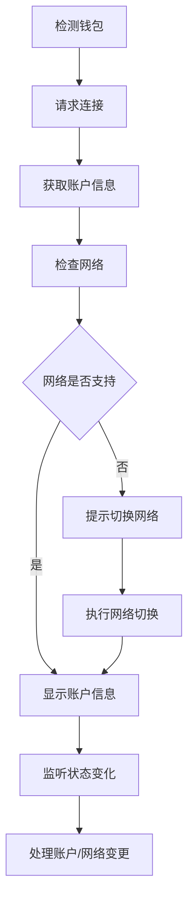

# 钱包连接功能实现文档

## 概述

钱包连接功能是Web3应用的核心基础设施，负责管理用户与以太坊钱包（如MetaMask）的连接、网络切换、账户管理等功能。本文档详细说明如何实现一个功能完善的钱包连接系统。

## 技术架构



## 核心功能模块

### 1. 钱包检测和连接

**组件文件**: `frontend/src/components/WalletConnect.tsx`

#### 1.1 环境检测

```typescript
// 检测是否安装了MetaMask
const isMetaMaskInstalled = (): boolean => {
  return typeof window !== 'undefined' && typeof window.ethereum !== 'undefined';
};

// 检测钱包类型
const getWalletType = (): string => {
  if (window.ethereum?.isMetaMask) return 'MetaMask';
  if (window.ethereum?.isTokenPocket) return 'TokenPocket';
  if (window.ethereum?.isCoinbaseWallet) return 'Coinbase Wallet';
  return 'Unknown Wallet';
};
```

#### 1.2 连接请求处理

```typescript
const connectWallet = async () => {
  if (!window.ethereum) {
    setErrorMessage("请安装 MetaMask 浏览器插件!");
    return;
  }

  try {
    setErrorMessage("");
    
    // 请求用户授权连接钱包
    await window.ethereum.request({ 
      method: "eth_requestAccounts" 
    });
    
    // 更新连接状态
    await updateState();
    
    console.log("钱包连接成功!");
    
  } catch (error) {
    console.error("连接失败:", error);
    
    // 处理用户拒绝连接
    if (error.code === 4001) {
      setErrorMessage("用户拒绝了连接请求");
    } else {
      setErrorMessage(`连接失败: ${getErrorMessage(error)}`);
    }
  }
};
```

### 2. 状态管理系统

#### 2.1 状态定义

```typescript
export const WalletConnect = () => {
  // 基础连接状态
  const [userAddress, setUserAddress] = useState<string | null>(null);
  const [network, setNetwork] = useState<{
    chainId: number;
    name: string;
  } | null>(null);
  
  // 网络支持检查
  const [isUnsupportedNetwork, setIsUnsupportedNetwork] = useState(false);
  
  // ENS和头像信息
  const [ensName, setEnsName] = useState<string | null>(null);
  const [avatarUrl, setAvatarUrl] = useState<string | null>(null);
  
  // UI状态管理
  const [copySuccess, setCopySuccess] = useState(false);
  const [isAccountModalOpen, setIsAccountModalOpen] = useState(false);
  const [isNetworkModalOpen, setIsNetworkModalOpen] = useState(false);
  
  // 错误处理
  const [errorMessage, setErrorMessage] = useState<string | null>(null);
```

#### 2.2 状态更新逻辑

```typescript
const updateState = async () => {
  if (!window.ethereum) return;
  
  try {
    const provider = new ethers.BrowserProvider(window.ethereum);
    
    // 获取已连接的账户
    const accounts = await provider.send("eth_accounts", []);

    if (accounts.length > 0) {
      const address = accounts[0];
      const network = await provider.getNetwork();
      const chainId = Number(network.chainId);

      // 更新基础信息
      setUserAddress(address);
      setNetwork({ chainId, name: network.name });

      // 检查网络支持情况
      const isSupported = supportedChains.some(
        (chain) => chain.chainId === chainId
      );
      setIsUnsupportedNetwork(!isSupported);

      // 获取ENS信息（仅主网和测试网支持）
      await fetchENSInfo(provider, address, chainId);
      
    } else {
      // 清空状态
      resetWalletState();
    }
  } catch (error) {
    console.error("更新状态失败:", getErrorMessage(error));
    resetWalletState();
  }
};

const resetWalletState = () => {
  setUserAddress(null);
  setNetwork(null);
  setIsUnsupportedNetwork(false);
  setEnsName(null);
  setAvatarUrl(null);
};
```

### 3. ENS集成实现

#### 3.1 ENS名称解析

```typescript
const fetchENSInfo = async (provider: ethers.BrowserProvider, address: string, chainId: number) => {
  try {
    // 只在主网和Sepolia测试网查询ENS
    if (chainId === 1 || chainId === 11155111) {
      // 反向解析：地址 -> ENS名称
      const ensName = await provider.lookupAddress(address);
      setEnsName(ensName);
      
      if (ensName) {
        // 获取ENS头像
        const avatarUrl = await provider.getAvatar(ensName);
        setAvatarUrl(avatarUrl);
        
        console.log(`ENS信息: ${ensName}, 头像: ${avatarUrl}`);
      } else {
        setAvatarUrl(null);
      }
    } else {
      // 非支持网络清空ENS信息
      setEnsName(null);
      setAvatarUrl(null);
    }
  } catch (ensError) {
    console.warn("ENS查询失败:", ensError);
    setEnsName(null);
    setAvatarUrl(null);
  }
};
```

#### 3.2 ENS正向解析

```typescript
const resolveENSName = async (ensName: string) => {
  try {
    const provider = new ethers.BrowserProvider(window.ethereum);
    
    // 正向解析：ENS名称 -> 地址
    const resolvedAddress = await provider.resolveName(ensName);
    
    if (resolvedAddress) {
      console.log(`${ensName} 解析为: ${resolvedAddress}`);
      return resolvedAddress;
    }
    
    return null;
  } catch (error) {
    console.error("ENS解析失败:", error);
    return null;
  }
};
```

### 4. 网络管理系统

#### 4.1 支持的网络配置

```typescript
const supportedChains = [
  {
    chainId: 11155111,
    hexChainId: "0xaa36a7",
    name: "Sepolia",
    rpcUrl: "https://rpc.sepolia.org",
    currency: "ETH",
    blockExplorer: "https://sepolia.etherscan.io"
  },
  {
    chainId: 1,
    hexChainId: "0x1",
    name: "Ethereum",
    rpcUrl: "https://mainnet.infura.io/v3/YOUR_KEY",
    currency: "ETH",
    blockExplorer: "https://etherscan.io"
  },
  {
    chainId: 137,
    hexChainId: "0x89",
    name: "Polygon",
    rpcUrl: "https://polygon-rpc.com",
    currency: "MATIC",
    blockExplorer: "https://polygonscan.com"
  },
  {
    chainId: 42161,
    hexChainId: "0xa4b1",
    name: "Arbitrum One",
    rpcUrl: "https://arb1.arbitrum.io/rpc",
    currency: "ETH",
    blockExplorer: "https://arbiscan.io"
  },
];
```

#### 4.2 网络切换实现

```typescript
const handleSwitchNetwork = async (chain: typeof supportedChains[0]) => {
  if (!window.ethereum) {
    setErrorMessage("钱包未连接");
    return;
  }

  try {
    // 请求切换到指定网络
    await window.ethereum.request({
      method: "wallet_switchEthereumChain",
      params: [{ chainId: chain.hexChainId }],
    });
    
    setIsNetworkModalOpen(false);
    console.log(`成功切换到 ${chain.name}`);
    
  } catch (switchError: any) {
    // 错误码4902表示网络未添加到钱包
    if (switchError.code === 4902) {
      try {
        // 添加新网络到钱包
        await window.ethereum.request({
          method: "wallet_addEthereumChain",
          params: [
            {
              chainId: chain.hexChainId,
              chainName: chain.name,
              rpcUrls: [chain.rpcUrl],
              nativeCurrency: {
                name: chain.currency,
                symbol: chain.currency,
                decimals: 18,
              },
              blockExplorerUrls: [chain.blockExplorer],
            },
          ],
        });
        
        setIsNetworkModalOpen(false);
        console.log(`成功添加并切换到 ${chain.name}`);
        
      } catch (addError) {
        console.error("添加网络失败:", addError);
        setErrorMessage("添加新网络失败");
      }
    } else {
      console.error("切换网络失败:", switchError);
      setErrorMessage("切换网络失败");
    }
  }
};
```

### 5. 事件监听系统

#### 5.1 账户变更监听

```typescript
useEffect(() => {
  if (!window.ethereum) return;

  // 监听账户变更
  const handleAccountsChanged = (accounts: string[]) => {
    console.log("账户发生变更:", accounts);
    
    if (accounts.length === 0) {
      // 用户断开了连接
      resetWalletState();
      console.log("用户已断开钱包连接");
    } else {
      // 切换到新账户
      updateState();
      console.log("切换到新账户:", accounts[0]);
    }
  };

  // 监听网络变更
  const handleChainChanged = (chainId: string) => {
    console.log("网络发生变更:", chainId);
    
    // 刷新页面或更新状态
    updateState();
  };

  // 注册事件监听器
  window.ethereum.on("accountsChanged", handleAccountsChanged);
  window.ethereum.on("chainChanged", handleChainChanged);

  // 清理函数
  return () => {
    window.ethereum?.removeListener("accountsChanged", handleAccountsChanged);
    window.ethereum?.removeListener("chainChanged", handleChainChanged);
  };
}, []);
```

#### 5.2 连接状态监听

```typescript
useEffect(() => {
  // 组件挂载时检查连接状态
  updateState();

  // 监听钱包连接事件
  const handleConnect = (connectInfo: { chainId: string }) => {
    console.log("钱包已连接:", connectInfo);
    updateState();
  };

  // 监听钱包断开事件
  const handleDisconnect = (error: { code: number; message: string }) => {
    console.log("钱包已断开:", error);
    resetWalletState();
  };

  window.ethereum?.on("connect", handleConnect);
  window.ethereum?.on("disconnect", handleDisconnect);

  return () => {
    window.ethereum?.removeListener("connect", handleConnect);
    window.ethereum?.removeListener("disconnect", handleDisconnect);
  };
}, []);
```

### 6. 用户界面实现

#### 6.1 连接按钮和状态显示

```typescript
return (
  <div className="wallet-container-v2">
    {!userAddress ? (
      // 未连接状态：显示连接按钮
      <button onClick={connectWallet} className="connect-button">
        连接钱包
      </button>
    ) : isUnsupportedNetwork ? (
      // 网络不支持：显示网络错误
      <button
        onClick={() => setIsNetworkModalOpen(true)}
        className="wrong-network-button-large"
      >
        网络错误
      </button>
    ) : (
      // 已连接状态：显示网络和账户信息
      <div className="profile-container">
        {network && (
          <button
            onClick={() => setIsNetworkModalOpen(true)}
            className="network-button"
          >
            {network.name === "unknown" 
              ? `Chain ID: ${network.chainId}` 
              : network.name}
          </button>
        )}
        
        <button
          onClick={() => setIsAccountModalOpen(true)}
          className="profile-button"
        >
          {avatarUrl ? (
            
          ) : (
            <div className="avatar-placeholder" />
          )}
          <span>{ensName || formattedAddress}</span>
        </button>
      </div>
    )}
```

#### 6.2 账户信息模态框

```typescript
{isAccountModalOpen && userAddress && createPortal(
  <div className="modal-overlay">
    <div className="modal-content" ref={accountModalRef}>
      <button
        onClick={() => setIsAccountModalOpen(false)}
        className="close-button"
      >
        &times;
      </button>
      
      <div className="modal-header">
        {avatarUrl ? (
          
        ) : (
          <div className="modal-avatar-placeholder" />
        )}
        <span className="modal-ens">{ensName || formattedAddress}</span>
        {ensName && (
          <span className="modal-address">{formattedAddress}</span>
        )}
      </div>
      
      <div className="modal-actions">
        <button onClick={handleCopyAddress} className="action-button">
          {copySuccess ? "已复制!" : "复制地址"}
        </button>
        <button
          onClick={handleDisconnect}
          className="action-button disconnect"
        >
          断开连接
        </button>
      </div>
    </div>
  </div>,
  document.body
)}
```

#### 6.3 网络切换模态框

```typescript
{isNetworkModalOpen && createPortal(
  <div className="modal-overlay">
    <div className="modal-content" ref={networkModalRef}>
      <button
        onClick={() => setIsNetworkModalOpen(false)}
        className="close-button"
      >
        &times;
      </button>
      
      <h3 className="modal-title">切换网络</h3>
      
      <div className="network-list">
        {supportedChains.map((chain) => (
          <button
            key={chain.chainId}
            className={`network-item ${
              network?.chainId === chain.chainId ? "active" : ""
            }`}
            onClick={() => handleSwitchNetwork(chain)}
          >
            {chain.name}
            {network?.chainId === chain.chainId && (
              <span className="connected-indicator"></span>
            )}
          </button>
        ))}
      </div>
    </div>
  </div>,
  document.body
)}
```

### 7. 实用工具函数

#### 7.1 地址格式化

```typescript
const formattedAddress = useMemo(() => {
  if (!userAddress) return "";
  return `${userAddress.substring(0, 6)}...${userAddress.substring(
    userAddress.length - 4
  )}`;
}, [userAddress]);
```

#### 7.2 地址复制功能

```typescript
const handleCopyAddress = async () => {
  if (userAddress) {
    try {
      await navigator.clipboard.writeText(userAddress);
      setCopySuccess(true);
      setTimeout(() => setCopySuccess(false), 2000);
      console.log("地址已复制到剪贴板");
    } catch (error) {
      console.error("复制失败:", error);
      // 降级方案：使用传统方法
      const textArea = document.createElement("textarea");
      textArea.value = userAddress;
      document.body.appendChild(textArea);
      textArea.select();
      document.execCommand("copy");
      document.body.removeChild(textArea);
      setCopySuccess(true);
      setTimeout(() => setCopySuccess(false), 2000);
    }
  }
};
```

#### 7.3 断开连接处理

```typescript
const handleDisconnect = () => {
  // 清理本地状态
  resetWalletState();
  setIsAccountModalOpen(false);
  
  console.log("用户主动断开连接");
  
  // 注意：MetaMask不支持程序性断开连接
  // 用户需要在钱包中手动断开连接
};
```

### 8. React Portal集成

为了确保模态框正确显示在页面最顶层，使用React Portal：

```typescript
import { createPortal } from "react-dom";

// 将模态框渲染到document.body
{isAccountModalOpen && userAddress && createPortal(
  <div className="modal-overlay">
    {/* 模态框内容 */}
  </div>,
  document.body
)}
```

## 错误处理和用户体验

### 1. 常见错误处理

```typescript
const getErrorMessage = (error: unknown): string => {
  if (error instanceof Error) {
    return error.message;
  }
  if (typeof error === "string") {
    return error;
  }
  if (typeof error === "object" && error !== null && "message" in error) {
    const message = (error as Record<string, unknown>).message;
    if (typeof message === "string") {
      return message;
    }
  }
  return "未知错误";
};
```

### 2. 用户引导

```typescript
// 检查并引导用户安装钱包
const checkWalletInstallation = () => {
  if (!isMetaMaskInstalled()) {
    return (
      <div className="wallet-guide">
        <p>需要安装MetaMask钱包才能使用此功能</p>
        <a 
          href="https://metamask.io/download/" 
          target="_blank" 
          rel="noopener noreferrer"
        >
          下载MetaMask
        </a>
      </div>
    );
  }
  return null;
};
```

## 安全考虑

### 1. 权限最小化原则

```typescript
// 只请求必要的权限
const requestMinimalPermissions = async () => {
  try {
    // 只请求账户访问权限
    const accounts = await window.ethereum.request({
      method: 'eth_requestAccounts'
    });
    
    // 不要求不必要的权限
    return accounts;
  } catch (error) {
    console.error('权限请求失败:', error);
    throw error;
  }
};
```

### 2. 输入验证

```typescript
// 验证网络配置
const validateNetworkConfig = (config: any) => {
  const required = ['chainId', 'chainName', 'rpcUrls', 'nativeCurrency'];
  
  for (const field of required) {
    if (!config[field]) {
      throw new Error(`缺少必需字段: ${field}`);
    }
  }
  
  // 验证URL格式
  if (!isValidUrl(config.rpcUrls[0])) {
    throw new Error('无效的RPC URL');
  }
  
  return true;
};
```

### 3. 状态一致性

```typescript
// 确保状态与钱包同步
const syncWithWallet = async () => {
  if (!window.ethereum) return;
  
  try {
    // 获取钱包中的当前状态
    const accounts = await window.ethereum.request({ method: 'eth_accounts' });
    const chainId = await window.ethereum.request({ method: 'eth_chainId' });
    
    // 与本地状态对比
    const localChainId = network?.chainId;
    const localAddress = userAddress;
    
    if (parseInt(chainId, 16) !== localChainId || accounts[0] !== localAddress) {
      console.log('检测到状态不一致，正在同步...');
      await updateState();
    }
  } catch (error) {
    console.error('状态同步失败:', error);
  }
};
```

## 性能优化

### 1. 状态缓存

```typescript
// 使用localStorage缓存连接状态
const saveConnectionState = (address: string, chainId: number) => {
  const state = {
    address,
    chainId,
    timestamp: Date.now()
  };
  localStorage.setItem('wallet_state', JSON.stringify(state));
};

const loadConnectionState = () => {
  try {
    const saved = localStorage.getItem('wallet_state');
    if (saved) {
      const state = JSON.parse(saved);
      // 检查是否过期（24小时）
      if (Date.now() - state.timestamp < 24 * 60 * 60 * 1000) {
        return state;
      }
    }
  } catch (error) {
    console.error('加载缓存状态失败:', error);
  }
  return null;
};
```

### 2. 防抖处理

```typescript
// 防抖处理网络切换
const debouncedNetworkChange = useMemo(
  () => debounce((chainId: string) => {
    updateState();
  }, 300),
  []
);

useEffect(() => {
  const handleChainChanged = debouncedNetworkChange;
  
  window.ethereum?.on('chainChanged', handleChainChanged);
  
  return () => {
    window.ethereum?.removeListener('chainChanged', handleChainChanged);
  };
}, [debouncedNetworkChange]);
```

## 测试策略

### 1. 单元测试

```typescript
// 测试地址格式化函数
describe('formatAddress', () => {
  test('正确格式化完整地址', () => {
    const address = '0x742d35Cc6634C0532925a3b8D7389a9bf3be4D';
    const formatted = formatAddress(address);
    expect(formatted).toBe('0x742d...be4D');
  });
  
  test('处理空地址', () => {
    expect(formatAddress('')).toBe('');
    expect(formatAddress(null)).toBe('');
  });
});
```

### 2. 集成测试

```typescript
// 测试钱包连接流程
describe('Wallet Connection', () => {
  test('成功连接MetaMask', async () => {
    // Mock MetaMask
    window.ethereum = {
      request: jest.fn().mockResolvedValue(['0x123...'])
    };
    
    const { getByText } = render(<WalletConnect />);
    const connectButton = getByText('连接钱包');
    
    fireEvent.click(connectButton);
    
    await waitFor(() => {
      expect(getByText(/0x123/)).toBeInTheDocument();
    });
  });
});
```

钱包连接功能是Web3应用的基础，需要处理各种复杂的状态管理和用户交互场景。通过完善的错误处理、用户体验优化和安全措施，可以为用户提供稳定可靠的钱包连接体验。