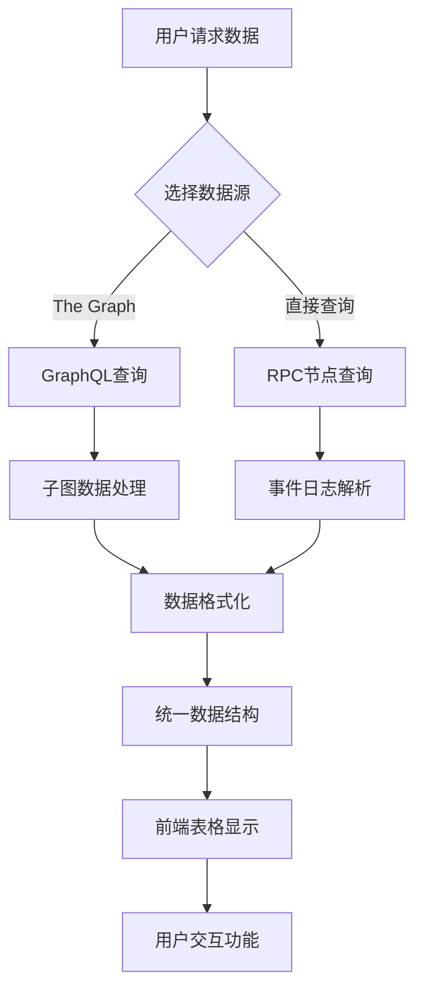

# 数据查询功能实现文档

## 概述

数据查询功能负责从区块链和The Graph协议中检索和展示已上链的数据记录。系统支持多种数据源的查询，包括智能合约事件、交易数据和去中心化索引服务，为用户提供统一的数据查看界面。

## 技术架构



## The Graph协议集成

### 第一步：子图(Subgraph)定义

**配置文件**: `onchain-data-subgraph/subgraph.yaml`

```yaml
specVersion: 0.0.5
schema:
  file: ./schema.graphql
dataSources:
  - kind: ethereum
    name: DataStorage
    network: sepolia
    source:
      address: "0x41dCf4E34eB2C231Cb03663D6e47ff271f621C4A"
      abi: DataStorage
      startBlock: 4500000
    mapping:
      kind: ethereum/events
      apiVersion: 0.0.7
      language: wasm/assemblyscript
      entities:
        - DataStoredEvent
      eventHandlers:
        - event: DataStored(indexed address,string,uint256)
          handler: handleDataStored
      file: ./src/data-storage.ts
```

**关键配置说明**：
- `network`: 指定区块链网络（sepolia测试网）
- `address`: 智能合约地址
- `startBlock`: 开始同步的区块号
- `eventHandlers`: 要监听的事件和处理函数

### 第二步：GraphQL模式定义

**模式文件**: `onchain-data-subgraph/schema.graphql`

```graphql
type DataStoredEvent @entity {
  id: ID!
  user: Bytes!           # 用户地址
  message: String!       # 存储的消息
  timestamp: BigInt!     # 时间戳
  blockNumber: BigInt!   # 区块号
  transactionHash: Bytes! # 交易哈希
}

type SwapWithMemoEvent @entity {
  id: ID!
  user: Bytes!
  amountIn: BigInt!
  amountOut: BigInt!
  tokenOut: Bytes!
  recipient: Bytes!
  memo: String!
  timestamp: BigInt!
  blockNumber: BigInt!
  transactionHash: Bytes!
}

# 用户统计信息
type UserStats @entity {
  id: ID!                    # 用户地址
  totalTransactions: BigInt! # 总交易数
  firstTransactionAt: BigInt! # 首次交易时间
  lastTransactionAt: BigInt!  # 最后交易时间
}
```

### 第三步：事件处理器实现

**处理器文件**: `onchain-data-subgraph/src/data-storage.ts`

```typescript
import { DataStored } from "../generated/DataStorage/DataStorage"
import { DataStoredEvent, UserStats } from "../generated/schema"
import { BigInt } from "@graphprotocol/graph-ts"

export function handleDataStored(event: DataStored): void {
  // 创建事件实体
  let entity = new DataStoredEvent(
    event.transaction.hash.concatI32(event.logIndex.toI32())
  )
  
  // 填充事件数据
  entity.user = event.params.user
  entity.message = event.params.message
  entity.timestamp = event.params.timestamp
  entity.blockNumber = event.block.number
  entity.transactionHash = event.transaction.hash
  
  // 保存事件实体
  entity.save()
  
  // 更新用户统计信息
  updateUserStats(
    event.params.user,
    event.params.timestamp,
    event.block.number
  )
}

function updateUserStats(
  userAddress: Address,
  timestamp: BigInt,
  blockNumber: BigInt
): void {
  let userStats = UserStats.load(userAddress.toHexString())
  
  if (userStats == null) {
    // 首次交易，创建用户统计
    userStats = new UserStats(userAddress.toHexString())
    userStats.totalTransactions = BigInt.fromI32(1)
    userStats.firstTransactionAt = timestamp
    userStats.lastTransactionAt = timestamp
  } else {
    // 更新统计信息
    userStats.totalTransactions = userStats.totalTransactions.plus(BigInt.fromI32(1))
    userStats.lastTransactionAt = timestamp
  }
  
  userStats.save()
}
```

## 前端数据查询实现

### 第一步：GraphQL客户端配置

**组件文件**: `frontend/src/components/DataList.tsx`

```typescript
import { useState, useEffect } from "react";

// The Graph子图端点
const SUBGRAPH_URL = "https://api.studio.thegraph.com/query/YOUR_SUBGRAPH_ID";

// GraphQL查询语句
const GET_DATA_EVENTS_QUERY = `
  query GetDataEvents($first: Int!, $skip: Int!, $orderBy: String!, $orderDirection: String!) {
    dataStoredEvents(
      first: $first
      skip: $skip
      orderBy: $orderBy
      orderDirection: $orderDirection
    ) {
      id
      user
      message
      timestamp
      blockNumber
      transactionHash
    }
  }
`;

const GET_SWAP_EVENTS_QUERY = `
  query GetSwapEvents($first: Int!, $skip: Int!) {
    swapWithMemoEvents(
      first: $first
      skip: $skip
      orderBy: timestamp
      orderDirection: desc
    ) {
      id
      user
      amountIn
      amountOut
      recipient
      memo
      timestamp
      transactionHash
    }
  }
`;
```

### 第二步：数据获取逻辑

```typescript
interface DataEvent {
  id: string;
  user: string;
  message: string;
  timestamp: string;
  blockNumber: string;
  transactionHash: string;
}

export const DataList = () => {
  const [data, setData] = useState<DataEvent[]>([]);
  const [loading, setLoading] = useState(false);
  const [error, setError] = useState<string | null>(null);
  
  // 分页参数
  const [currentPage, setCurrentPage] = useState(0);
  const [pageSize] = useState(10);
  const [hasMore, setHasMore] = useState(true);

  // 从The Graph获取数据
  const fetchDataFromGraph = async (reset: boolean = false) => {
    if (loading) return;
    
    setLoading(true);
    setError(null);
    
    try {
      const skip = reset ? 0 : currentPage * pageSize;
      
      const response = await fetch(SUBGRAPH_URL, {
        method: "POST",
        headers: {
          "Content-Type": "application/json",
        },
        body: JSON.stringify({
          query: GET_DATA_EVENTS_QUERY,
          variables: {
            first: pageSize,
            skip: skip,
            orderBy: "timestamp",
            orderDirection: "desc"
          },
        }),
      });

      if (!response.ok) {
        throw new Error(`HTTP error! status: ${response.status}`);
      }

      const result = await response.json();
      
      if (result.errors) {
        throw new Error(result.errors[0].message);
      }

      const newData = result.data.dataStoredEvents;
      
      if (reset) {
        setData(newData);
        setCurrentPage(1);
      } else {
        setData(prev => [...prev, ...newData]);
        setCurrentPage(prev => prev + 1);
      }
      
      // 检查是否有更多数据
      setHasMore(newData.length === pageSize);
      
    } catch (err) {
      console.error("获取数据失败:", err);
      setError(err instanceof Error ? err.message : "获取数据失败");
    } finally {
      setLoading(false);
    }
  };
```

### 第三步：直接RPC查询作为备选方案

```typescript
// 直接从区块链查询事件（作为The Graph的备选方案）
const fetchDataFromRPC = async () => {
  if (!window.ethereum) {
    setError("请安装MetaMask");
    return;
  }

  setLoading(true);
  setError(null);

  try {
    const provider = new ethers.BrowserProvider(window.ethereum);
    const contract = new ethers.Contract(
      contractAddress,
      DataStorageABI.abi,
      provider
    );

    // 获取最新区块号
    const latestBlock = await provider.getBlockNumber();
    const fromBlock = Math.max(latestBlock - 10000, 0); // 查询最近10000个区块

    console.log(`查询区块范围: ${fromBlock} -> ${latestBlock}`);

    // 创建事件过滤器
    const filter = contract.filters.DataStored();
    
    // 查询事件日志
    const events = await contract.queryFilter(filter, fromBlock, latestBlock);

    // 处理事件数据
    const processedData = await Promise.all(
      events.map(async (event) => {
        const block = await event.getBlock();
        return {
          id: `${event.transactionHash}-${event.index}`,
          user: event.args.user,
          message: event.args.message,
          timestamp: event.args.timestamp.toString(),
          blockNumber: event.blockNumber.toString(),
          transactionHash: event.transactionHash,
          from: event.args.user, // 兼容显示格式
        };
      })
    );

    // 按时间戳降序排序
    processedData.sort((a, b) => parseInt(b.timestamp) - parseInt(a.timestamp));
    
    setData(processedData);
    console.log(`成功获取 ${processedData.length} 条记录`);

  } catch (err) {
    console.error("RPC查询失败:", err);
    setError(`查询失败: ${err instanceof Error ? err.message : "未知错误"}`);
  } finally {
    setLoading(false);
  }
};
```

### 第四步：数据源切换逻辑

```typescript
// 智能数据源选择
const fetchData = async (reset: boolean = false) => {
  // 优先尝试The Graph，失败时回退到直接RPC查询
  try {
    await fetchDataFromGraph(reset);
  } catch (graphError) {
    console.warn("The Graph查询失败，回退到RPC查询:", graphError);
    
    // 如果是第一页数据，尝试RPC查询
    if (reset || currentPage === 0) {
      await fetchDataFromRPC();
    } else {
      setError("数据加载失败，请刷新重试");
    }
  }
};

// 组件挂载时获取数据
useEffect(() => {
  fetchData(true);
}, []);
```

### 第五步：高级查询功能

#### 5.1 搜索和过滤

```typescript
const [searchParams, setSearchParams] = useState({
  user: "",           // 按用户地址搜索
  message: "",        // 按消息内容搜索
  fromDate: "",       // 起始日期
  toDate: "",         // 结束日期
});

// 构建带搜索条件的GraphQL查询
const buildSearchQuery = () => {
  let whereClause = "";
  const conditions = [];
  
  if (searchParams.user) {
    conditions.push(`user: "${searchParams.user}"`);
  }
  
  if (searchParams.message) {
    conditions.push(`message_contains_nocase: "${searchParams.message}"`);
  }
  
  if (searchParams.fromDate) {
    const timestamp = Math.floor(new Date(searchParams.fromDate).getTime() / 1000);
    conditions.push(`timestamp_gte: "${timestamp}"`);
  }
  
  if (searchParams.toDate) {
    const timestamp = Math.floor(new Date(searchParams.toDate).getTime() / 1000);
    conditions.push(`timestamp_lte: "${timestamp}"`);
  }
  
  if (conditions.length > 0) {
    whereClause = `where: { ${conditions.join(", ")} }`;
  }
  
  return `
    query GetFilteredDataEvents($first: Int!, $skip: Int!) {
      dataStoredEvents(
        first: $first
        skip: $skip
        ${whereClause}
        orderBy: timestamp
        orderDirection: desc
      ) {
        id
        user
        message
        timestamp
        blockNumber
        transactionHash
      }
    }
  `;
};
```

#### 5.2 实时数据订阅

```typescript
// WebSocket订阅实时数据更新
const subscribeToUpdates = () => {
  const wsUrl = SUBGRAPH_URL.replace('https://', 'wss://').replace('/query/', '/ws/');
  
  const ws = new WebSocket(wsUrl);
  
  ws.onopen = () => {
    console.log("WebSocket连接已建立");
    
    // 发送订阅请求
    ws.send(JSON.stringify({
      type: "start",
      payload: {
        query: `
          subscription {
            dataStoredEvents(
              orderBy: timestamp
              orderDirection: desc
              first: 1
            ) {
              id
              user
              message
              timestamp
              transactionHash
            }
          }
        `
      }
    }));
  };
  
  ws.onmessage = (event) => {
    const data = JSON.parse(event.data);
    
    if (data.type === "data" && data.payload.data.dataStoredEvents) {
      const newEvent = data.payload.data.dataStoredEvents[0];
      
      // 将新事件添加到列表顶部
      setData(prev => [newEvent, ...prev]);
      
      console.log("收到新的数据事件:", newEvent);
    }
  };
  
  ws.onerror = (error) => {
    console.error("WebSocket错误:", error);
  };
  
  return () => {
    ws.close();
  };
};

// 组件挂载时启动订阅
useEffect(() => {
  const unsubscribe = subscribeToUpdates();
  return unsubscribe;
}, []);
```

### 第六步：数据展示界面

```typescript
return (
  <div className="data-container">
    {/* 搜索和过滤界面 */}
    <div className="search-controls">
      <div className="search-row">
        <input
          type="text"
          placeholder="搜索用户地址..."
          value={searchParams.user}
          onChange={(e) => setSearchParams(prev => ({...prev, user: e.target.value}))}
        />
        <input
          type="text"
          placeholder="搜索消息内容..."
          value={searchParams.message}
          onChange={(e) => setSearchParams(prev => ({...prev, message: e.target.value}))}
        />
      </div>
      
      <div className="date-row">
        <input
          type="date"
          value={searchParams.fromDate}
          onChange={(e) => setSearchParams(prev => ({...prev, fromDate: e.target.value}))}
        />
        <input
          type="date"
          value={searchParams.toDate}
          onChange={(e) => setSearchParams(prev => ({...prev, toDate: e.target.value}))}
        />
        <button onClick={() => fetchData(true)}>搜索</button>
      </div>
    </div>

    {/* 刷新按钮 */}
    <button onClick={() => fetchData(true)} className="refresh-button" disabled={loading}>
      {loading ? "加载中..." : "刷新数据"}
    </button>

    {/* 错误显示 */}
    {error && (
      <div className="error-message">
        <p>加载数据失败: {error}</p>
        <button onClick={() => fetchData(true)}>重试</button>
      </div>
    )}

    {/* 数据表格 */}
    {data.length === 0 && !loading ? (
      <p>还没有任何数据记录。</p>
    ) : (
      <div className="data-table-wrapper">
        <table className="data-table">
          <thead>
            <tr>
              <th>消息</th>
              <th>发送者</th>
              <th>时间</th>
              <th>交易</th>
            </tr>
          </thead>
          <tbody>
            {data.map((event) => (
              <tr key={event.id}>
                <td>{event.message}</td>
                <td title={event.user}>
                  {`${event.user.substring(0, 6)}...${event.user.substring(event.user.length - 4)}`}
                </td>
                <td>
                  {new Date(parseInt(event.timestamp) * 1000).toLocaleString()}
                </td>
                <td>
                  <a
                    href={`https://sepolia.etherscan.io/tx/${event.transactionHash}`}
                    target="_blank"
                    rel="noopener noreferrer"
                    className="tx-link"
                  >
                    查看交易
                  </a>
                </td>
              </tr>
            ))}
          </tbody>
        </table>
        
        {/* 加载更多按钮 */}
        {hasMore && (
          <div className="load-more">
            <button 
              onClick={() => fetchData(false)}
              disabled={loading}
              className="load-more-button"
            >
              {loading ? "加载中..." : "加载更多"}
            </button>
          </div>
        )}
      </div>
    )}

    {/* 数据统计 */}
    <div className="data-stats">
      <p>共找到 {data.length} 条记录</p>
      {data.length > 0 && (
        <p>
          最新记录时间: {new Date(parseInt(data[0].timestamp) * 1000).toLocaleString()}
        </p>
      )}
    </div>
  </div>
);
```

## 性能优化策略

### 1. 数据缓存机制

```typescript
// 使用React Query进行数据缓存
import { useQuery, useInfiniteQuery } from 'react-query';

const useDataEvents = (searchParams: SearchParams) => {
  return useInfiniteQuery(
    ['dataEvents', searchParams],
    ({ pageParam = 0 }) => fetchDataPage(pageParam, searchParams),
    {
      getNextPageParam: (lastPage, pages) => {
        return lastPage.hasMore ? pages.length : undefined;
      },
      staleTime: 5 * 60 * 1000, // 5分钟内使用缓存
      cacheTime: 10 * 60 * 1000, // 10分钟缓存时间
    }
  );
};
```

### 2. 虚拟滚动

```typescript
// 使用react-window进行虚拟滚动
import { FixedSizeList as List } from 'react-window';

const VirtualizedTable = ({ data }: { data: DataEvent[] }) => {
  const Row = ({ index, style }: { index: number; style: React.CSSProperties }) => (
    <div style={style} className="table-row">
      <div className="cell">{data[index].message}</div>
      <div className="cell">{data[index].user}</div>
      <div className="cell">{new Date(parseInt(data[index].timestamp) * 1000).toLocaleString()}</div>
    </div>
  );

  return (
    <List
      height={600}
      itemCount={data.length}
      itemSize={60}
      itemData={data}
    >
      {Row}
    </List>
  );
};
```

### 3. 数据预加载

```typescript
// 预加载下一页数据
const preloadNextPage = useCallback(() => {
  if (!loading && hasMore && data.length > 0) {
    // 在用户滚动到80%时预加载
    const scrollPosition = window.scrollY + window.innerHeight;
    const documentHeight = document.documentElement.scrollHeight;
    
    if (scrollPosition / documentHeight > 0.8) {
      fetchData(false);
    }
  }
}, [loading, hasMore, data.length]);

useEffect(() => {
  window.addEventListener('scroll', preloadNextPage);
  return () => window.removeEventListener('scroll', preloadNextPage);
}, [preloadNextPage]);
```

## 数据分析和可视化

### 1. 统计信息查询

```typescript
const GET_STATS_QUERY = `
  query GetStats {
    userStats(orderBy: totalTransactions, orderDirection: desc, first: 10) {
      id
      totalTransactions
      firstTransactionAt
      lastTransactionAt
    }
    
    dataStoredEvents(first: 1000) {
      timestamp
    }
  }
`;

const generateStatistics = (events: DataEvent[]) => {
  // 按日期统计
  const dailyStats = events.reduce((acc, event) => {
    const date = new Date(parseInt(event.timestamp) * 1000).toDateString();
    acc[date] = (acc[date] || 0) + 1;
    return acc;
  }, {} as Record<string, number>);
  
  // 按用户统计
  const userStats = events.reduce((acc, event) => {
    acc[event.user] = (acc[event.user] || 0) + 1;
    return acc;
  }, {} as Record<string, number>);
  
  return { dailyStats, userStats };
};
```

### 2. 图表集成

```typescript
// 使用Chart.js显示统计图表
import { Line, Bar } from 'react-chartjs-2';

const DataChart = ({ data }: { data: DataEvent[] }) => {
  const { dailyStats } = generateStatistics(data);
  
  const chartData = {
    labels: Object.keys(dailyStats),
    datasets: [
      {
        label: '每日交易数',
        data: Object.values(dailyStats),
        borderColor: 'rgb(75, 192, 192)',
        backgroundColor: 'rgba(75, 192, 192, 0.2)',
      },
    ],
  };

  return (
    <div className="chart-container">
      <h3>数据统计</h3>
      <Line data={chartData} />
    </div>
  );
};
```

## 错误处理和降级策略

### 1. 多数据源降级

```typescript
const dataSourceStrategy = [
  {
    name: 'The Graph',
    fetch: fetchDataFromGraph,
    priority: 1
  },
  {
    name: 'Direct RPC',
    fetch: fetchDataFromRPC,
    priority: 2
  },
  {
    name: 'Local Cache',
    fetch: fetchDataFromCache,
    priority: 3
  }
];

const fetchWithFallback = async (reset: boolean = false) => {
  let lastError: Error | null = null;
  
  for (const source of dataSourceStrategy) {
    try {
      console.log(`尝试数据源: ${source.name}`);
      await source.fetch(reset);
      console.log(`成功使用数据源: ${source.name}`);
      return;
    } catch (error) {
      console.warn(`数据源 ${source.name} 失败:`, error);
      lastError = error as Error;
    }
  }
  
  // 所有数据源都失败
  setError(`所有数据源都不可用: ${lastError?.message}`);
};
```

### 2. 离线支持

```typescript
// Service Worker缓存策略
const cacheData = (key: string, data: any) => {
  if ('caches' in window) {
    caches.open('data-cache-v1').then(cache => {
      cache.put(key, new Response(JSON.stringify(data)));
    });
  }
};

const getCachedData = async (key: string) => {
  if ('caches' in window) {
    const cache = await caches.open('data-cache-v1');
    const response = await cache.match(key);
    if (response) {
      return await response.json();
    }
  }
  return null;
};
```

## 部署和监控

### 1. The Graph子图部署

```bash
# 安装Graph CLI
npm install -g @graphprotocol/graph-cli

# 构建子图
graph codegen && graph build

# 部署到The Graph Studio
graph deploy --studio your-subgraph-name
```

### 2. 性能监控

```typescript
// 添加性能监控
const trackQueryPerformance = (queryName: string, startTime: number) => {
  const endTime = Date.now();
  const duration = endTime - startTime;
  
  // 发送到监控服务
  analytics.track('GraphQL Query', {
    queryName,
    duration,
    timestamp: endTime,
  });
  
  console.log(`查询 ${queryName} 耗时: ${duration}ms`);
};
```

数据查询功能是链上数据系统的核心，通过整合The Graph协议和直接RPC查询，提供了高效、可靠的数据访问能力。完善的错误处理、性能优化和用户体验设计，确保了系统在各种情况下都能正常工作。