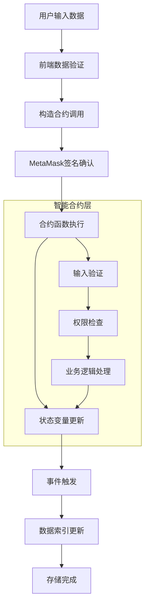

# 智能合约直接存储功能实现文档

## 概述

智能合约直接存储功能通过调用智能合约的存储函数，将数据直接写入合约的状态变量中。这种方法提供了最高的数据结构化程度和查询灵活性，支持复杂的数据管理逻辑，是企业级应用的首选方案。

## 技术特点

### 优势
- **数据结构化**: 支持复杂的数据类型和结构
- **查询灵活**: 可通过合约函数灵活查询和筛选数据  
- **权限控制**: 支持细粒度的访问控制和权限管理
- **业务逻辑**: 可在合约中实现复杂的业务逻辑
- **数据完整性**: 通过合约逻辑保证数据的完整性和一致性

### 限制
- **Gas成本**: 存储到状态变量的Gas成本相对较高
- **合约依赖**: 需要预先部署智能合约
- **升级复杂**: 合约升级需要考虑数据迁移问题

## 技术架构



## 智能合约设计

### 1. 数据结构定义

```solidity
// SPDX-License-Identifier: MIT
pragma solidity ^0.8.0;

import "@openzeppelin/contracts/access/Ownable.sol";
import "@openzeppelin/contracts/security/Pausable.sol";
import "@openzeppelin/contracts/security/ReentrancyGuard.sol";
import "@openzeppelin/contracts/utils/Counters.sol";

contract DirectDataStorage is Ownable, Pausable, ReentrancyGuard {
    using Counters for Counters.Counter;
    
    // 数据记录结构
    struct DataRecord {
        uint256 id;                 // 唯一标识
        address owner;              // 数据拥有者
        string title;               // 数据标题
        string content;             // 数据内容
        string category;            // 数据分类
        uint256 timestamp;          // 创建时间
        uint256 lastModified;       // 最后修改时间
        bool isPublic;             // 是否公开
        bool isActive;             // 是否激活
        string[] tags;             // 标签数组
        mapping(address => bool) accessList; // 访问控制列表
    }
    
    // 状态变量
    Counters.Counter private _dataIdCounter;
    mapping(uint256 => DataRecord) private _dataRecords;
    mapping(address => uint256[]) private _ownerDataIds;
    mapping(string => uint256[]) private _categoryDataIds;
    mapping(string => uint256[]) private _tagDataIds;
    
    // 分页查询配置
    uint256 public constant MAX_PAGE_SIZE = 100;
    uint256 public constant DEFAULT_PAGE_SIZE = 20;
    
    // 数据限制
    uint256 public constant MAX_TITLE_LENGTH = 200;
    uint256 public constant MAX_CONTENT_LENGTH = 5000;
    uint256 public constant MAX_CATEGORY_LENGTH = 50;
    uint256 public constant MAX_TAGS_COUNT = 10;
    uint256 public constant MAX_TAG_LENGTH = 30;
    
    // 事件定义
    event DataStored(
        uint256 indexed dataId,
        address indexed owner,
        string indexed category,
        string title,
        uint256 timestamp
    );
    
    event DataUpdated(
        uint256 indexed dataId,
        address indexed owner,
        string title,
        uint256 timestamp
    );
    
    event DataDeleted(
        uint256 indexed dataId,
        address indexed owner,
        uint256 timestamp
    );
    
    event AccessGranted(
        uint256 indexed dataId,
        address indexed grantee,
        address indexed grantor
    );
    
    event AccessRevoked(
        uint256 indexed dataId,
        address indexed revokee,
        address indexed revoker
    );
```

### 2. 核心存储函数

```solidity
    /**
     * @dev 存储新数据记录
     * @param title 数据标题
     * @param content 数据内容  
     * @param category 数据分类
     * @param tags 标签数组
     * @param isPublic 是否公开
     * @return dataId 新创建的数据ID
     */
    function storeData(
        string memory title,
        string memory content,
        string memory category,
        string[] memory tags,
        bool isPublic
    ) external whenNotPaused nonReentrant returns (uint256) {
        // 输入验证
        require(bytes(title).length > 0 && bytes(title).length <= MAX_TITLE_LENGTH, 
                "Invalid title length");
        require(bytes(content).length > 0 && bytes(content).length <= MAX_CONTENT_LENGTH, 
                "Invalid content length");
        require(bytes(category).length > 0 && bytes(category).length <= MAX_CATEGORY_LENGTH, 
                "Invalid category length");
        require(tags.length <= MAX_TAGS_COUNT, "Too many tags");
        
        // 验证标签
        for (uint i = 0; i < tags.length; i++) {
            require(bytes(tags[i]).length > 0 && bytes(tags[i]).length <= MAX_TAG_LENGTH,
                    "Invalid tag length");
        }
        
        // 生成新的数据ID
        uint256 dataId = _dataIdCounter.current();
        _dataIdCounter.increment();
        
        // 创建数据记录
        DataRecord storage record = _dataRecords[dataId];
        record.id = dataId;
        record.owner = msg.sender;
        record.title = title;
        record.content = content;
        record.category = category;
        record.timestamp = block.timestamp;
        record.lastModified = block.timestamp;
        record.isPublic = isPublic;
        record.isActive = true;
        record.tags = tags;
        
        // 更新索引
        _ownerDataIds[msg.sender].push(dataId);
        _categoryDataIds[category].push(dataId);
        
        // 更新标签索引
        for (uint i = 0; i < tags.length; i++) {
            _tagDataIds[tags[i]].push(dataId);
        }
        
        // 触发事件
        emit DataStored(dataId, msg.sender, category, title, block.timestamp);
        
        return dataId;
    }
    
    /**
     * @dev 更新数据记录
     * @param dataId 数据ID
     * @param title 新标题
     * @param content 新内容
     * @param tags 新标签数组
     * @param isPublic 是否公开
     */
    function updateData(
        uint256 dataId,
        string memory title,
        string memory content,
        string[] memory tags,
        bool isPublic
    ) external whenNotPaused nonReentrant {
        require(_dataRecords[dataId].owner == msg.sender, "Not the owner");
        require(_dataRecords[dataId].isActive, "Data record is inactive");
        
        // 输入验证
        require(bytes(title).length > 0 && bytes(title).length <= MAX_TITLE_LENGTH, 
                "Invalid title length");
        require(bytes(content).length > 0 && bytes(content).length <= MAX_CONTENT_LENGTH, 
                "Invalid content length");
        require(tags.length <= MAX_TAGS_COUNT, "Too many tags");
        
        DataRecord storage record = _dataRecords[dataId];
        
        // 清理旧标签索引
        for (uint i = 0; i < record.tags.length; i++) {
            _removeFromTagIndex(record.tags[i], dataId);
        }
        
        // 更新记录
        record.title = title;
        record.content = content;
        record.tags = tags;
        record.isPublic = isPublic;
        record.lastModified = block.timestamp;
        
        // 更新新标签索引
        for (uint i = 0; i < tags.length; i++) {
            _tagDataIds[tags[i]].push(dataId);
        }
        
        emit DataUpdated(dataId, msg.sender, title, block.timestamp);
    }
    
    /**
     * @dev 软删除数据记录
     * @param dataId 数据ID
     */
    function deleteData(uint256 dataId) external whenNotPaused {
        require(_dataRecords[dataId].owner == msg.sender, "Not the owner");
        require(_dataRecords[dataId].isActive, "Data already inactive");
        
        _dataRecords[dataId].isActive = false;
        _dataRecords[dataId].lastModified = block.timestamp;
        
        emit DataDeleted(dataId, msg.sender, block.timestamp);
    }
```

### 3. 查询函数

```solidity
    /**
     * @dev 获取数据记录详情
     * @param dataId 数据ID
     * @return 数据记录的详细信息
     */
    function getDataRecord(uint256 dataId) external view returns (
        uint256 id,
        address owner,
        string memory title,
        string memory content,
        string memory category,
        uint256 timestamp,
        uint256 lastModified,
        bool isPublic,
        bool isActive,
        string[] memory tags
    ) {
        require(_hasReadAccess(dataId, msg.sender), "Access denied");
        
        DataRecord storage record = _dataRecords[dataId];
        return (
            record.id,
            record.owner,
            record.title,
            record.content,
            record.category,
            record.timestamp,
            record.lastModified,
            record.isPublic,
            record.isActive,
            record.tags
        );
    }
    
    /**
     * @dev 分页获取用户的数据记录
     * @param owner 用户地址
     * @param page 页码（从0开始）
     * @param pageSize 每页大小
     * @return ids 数据ID数组
     * @return titles 标题数组
     * @return categories 分类数组
     * @return timestamps 时间戳数组
     * @return hasMore 是否还有更多数据
     */
    function getUserDataRecords(
        address owner,
        uint256 page,
        uint256 pageSize
    ) external view returns (
        uint256[] memory ids,
        string[] memory titles,
        string[] memory categories,
        uint256[] memory timestamps,
        bool hasMore
    ) {
        require(pageSize > 0 && pageSize <= MAX_PAGE_SIZE, "Invalid page size");
        
        uint256[] storage userDataIds = _ownerDataIds[owner];
        uint256 totalCount = userDataIds.length;
        uint256 startIndex = page * pageSize;
        
        require(startIndex < totalCount, "Page out of range");
        
        uint256 endIndex = startIndex + pageSize;
        if (endIndex > totalCount) {
            endIndex = totalCount;
        }
        
        uint256 resultSize = endIndex - startIndex;
        ids = new uint256[](resultSize);
        titles = new string[](resultSize);
        categories = new string[](resultSize);
        timestamps = new uint256[](resultSize);
        
        uint256 resultIndex = 0;
        for (uint256 i = startIndex; i < endIndex; i++) {
            uint256 dataId = userDataIds[i];
            DataRecord storage record = _dataRecords[dataId];
            
            if (record.isActive && _hasReadAccess(dataId, msg.sender)) {
                ids[resultIndex] = record.id;
                titles[resultIndex] = record.title;
                categories[resultIndex] = record.category;
                timestamps[resultIndex] = record.timestamp;
                resultIndex++;
            }
        }
        
        // 调整数组大小
        assembly {
            mstore(ids, resultIndex)
            mstore(titles, resultIndex)
            mstore(categories, resultIndex)
            mstore(timestamps, resultIndex)
        }
        
        hasMore = endIndex < totalCount;
    }
    
    /**
     * @dev 按分类查询数据记录
     * @param category 分类名称
     * @param page 页码
     * @param pageSize 每页大小
     * @return 分页数据结果
     */
    function getDataRecordsByCategory(
        string memory category,
        uint256 page,
        uint256 pageSize
    ) external view returns (
        uint256[] memory ids,
        string[] memory titles,
        address[] memory owners,
        uint256[] memory timestamps,
        bool hasMore
    ) {
        require(pageSize > 0 && pageSize <= MAX_PAGE_SIZE, "Invalid page size");
        
        uint256[] storage categoryDataIds = _categoryDataIds[category];
        uint256 totalCount = categoryDataIds.length;
        uint256 startIndex = page * pageSize;
        
        require(startIndex < totalCount, "Page out of range");
        
        uint256 endIndex = startIndex + pageSize;
        if (endIndex > totalCount) {
            endIndex = totalCount;
        }
        
        uint256 resultSize = endIndex - startIndex;
        ids = new uint256[](resultSize);
        titles = new string[](resultSize);
        owners = new address[](resultSize);
        timestamps = new uint256[](resultSize);
        
        uint256 resultIndex = 0;
        for (uint256 i = startIndex; i < endIndex; i++) {
            uint256 dataId = categoryDataIds[i];
            DataRecord storage record = _dataRecords[dataId];
            
            if (record.isActive && _hasReadAccess(dataId, msg.sender)) {
                ids[resultIndex] = record.id;
                titles[resultIndex] = record.title;
                owners[resultIndex] = record.owner;
                timestamps[resultIndex] = record.timestamp;
                resultIndex++;
            }
        }
        
        // 调整数组大小
        assembly {
            mstore(ids, resultIndex)
            mstore(titles, resultIndex)
            mstore(owners, resultIndex)
            mstore(timestamps, resultIndex)
        }
        
        hasMore = endIndex < totalCount;
    }
```

### 4. 权限管理

```solidity
    /**
     * @dev 授权访问权限
     * @param dataId 数据ID
     * @param grantee 被授权者地址
     */
    function grantAccess(uint256 dataId, address grantee) external {
        require(_dataRecords[dataId].owner == msg.sender, "Not the owner");
        require(_dataRecords[dataId].isActive, "Data record is inactive");
        require(grantee != address(0), "Invalid grantee address");
        
        _dataRecords[dataId].accessList[grantee] = true;
        
        emit AccessGranted(dataId, grantee, msg.sender);
    }
    
    /**
     * @dev 撤销访问权限
     * @param dataId 数据ID
     * @param revokee 被撤销者地址
     */
    function revokeAccess(uint256 dataId, address revokee) external {
        require(_dataRecords[dataId].owner == msg.sender, "Not the owner");
        
        _dataRecords[dataId].accessList[revokee] = false;
        
        emit AccessRevoked(dataId, revokee, msg.sender);
    }
    
    /**
     * @dev 检查读取权限
     * @param dataId 数据ID
     * @param user 用户地址
     * @return 是否有读取权限
     */
    function _hasReadAccess(uint256 dataId, address user) internal view returns (bool) {
        DataRecord storage record = _dataRecords[dataId];
        
        // 数据拥有者总是有权限
        if (record.owner == user) {
            return true;
        }
        
        // 公开数据任何人都可以读取
        if (record.isPublic) {
            return true;
        }
        
        // 检查访问控制列表
        return record.accessList[user];
    }
    
    /**
     * @dev 获取数据总数
     * @return 总数据记录数
     */
    function getTotalDataCount() external view returns (uint256) {
        return _dataIdCounter.current();
    }
    
    /**
     * @dev 获取用户数据记录数
     * @param owner 用户地址
     * @return 用户的数据记录数
     */
    function getUserDataCount(address owner) external view returns (uint256) {
        return _ownerDataIds[owner].length;
    }
    
    /**
     * @dev 获取分类数据记录数
     * @param category 分类名称
     * @return 分类的数据记录数
     */
    function getCategoryDataCount(string memory category) external view returns (uint256) {
        return _categoryDataIds[category].length;
    }
    
    // 内部辅助函数
    function _removeFromTagIndex(string memory tag, uint256 dataId) internal {
        uint256[] storage tagIds = _tagDataIds[tag];
        for (uint256 i = 0; i < tagIds.length; i++) {
            if (tagIds[i] == dataId) {
                tagIds[i] = tagIds[tagIds.length - 1];
                tagIds.pop();
                break;
            }
        }
    }
    
    // 管理员功能
    function pause() external onlyOwner {
        _pause();
    }
    
    function unpause() external onlyOwner {
        _unpause();
    }
}
```

## 前端集成实现

### 1. React组件设计

```typescript
// frontend/src/components/DirectStorageForm.tsx
import React, { useState, useEffect } from 'react';
import { ethers } from 'ethers';
import DirectDataStorageABI from '../abi/DirectDataStorage.json';

const CONTRACT_ADDRESS = "0x..."; // 部署后的合约地址

interface DirectStorageFormProps {
  onSuccess?: (dataId: number) => void;
  onError?: (error: string) => void;
}

export const DirectStorageForm: React.FC<DirectStorageFormProps> = ({
  onSuccess,
  onError
}) => {
  // 表单状态
  const [formData, setFormData] = useState({
    title: '',
    content: '',
    category: '',
    tags: '',
    isPublic: false
  });
  
  // 交易状态
  const [txStatus, setTxStatus] = useState<'idle' | 'pending' | 'success' | 'error'>('idle');
  const [txHash, setTxHash] = useState('');
  const [errorMessage, setErrorMessage] = useState('');
  const [dataId, setDataId] = useState<number | null>(null);

  // 处理表单提交
  const handleSubmit = async (e: React.FormEvent) => {
    e.preventDefault();
    
    // 输入验证
    if (!formData.title.trim() || !formData.content.trim() || !formData.category.trim()) {
      setErrorMessage('请填写所有必需字段');
      return;
    }
    
    if (!window.ethereum) {
      setErrorMessage('请安装 MetaMask!');
      return;
    }

    try {
      setErrorMessage('');
      setTxStatus('pending');

      // 连接钱包和合约
      const provider = new ethers.BrowserProvider(window.ethereum);
      const signer = await provider.getSigner();
      const contract = new ethers.Contract(CONTRACT_ADDRESS, DirectDataStorageABI.abi, signer);

      // 处理标签
      const tagsArray = formData.tags
        .split(',')
        .map(tag => tag.trim())
        .filter(tag => tag.length > 0)
        .slice(0, 10); // 限制最多10个标签

      console.log('存储数据到智能合约...');
      console.log('数据:', {
        title: formData.title,
        category: formData.category,
        tagsCount: tagsArray.length,
        isPublic: formData.isPublic
      });

      // 估算Gas费用
      const gasEstimate = await contract.storeData.estimateGas(
        formData.title,
        formData.content,
        formData.category,
        tagsArray,
        formData.isPublic
      );
      
      console.log('预估Gas用量:', gasEstimate.toString());

      // 调用合约存储函数
      const tx = await contract.storeData(
        formData.title,
        formData.content,
        formData.category,
        tagsArray,
        formData.isPublic,
        {
          gasLimit: gasEstimate * 120n / 100n // 增加20%的Gas缓冲
        }
      );
      
      setTxHash(tx.hash);
      console.log('交易已发送:', tx.hash);

      // 等待交易确认
      const receipt = await tx.wait();
      console.log('交易已确认!');
      
      // 从交易回执中获取数据ID
      const event = receipt.logs.find((log: any) => {
        try {
          const parsedLog = contract.interface.parseLog(log);
          return parsedLog?.name === 'DataStored';
        } catch {
          return false;
        }
      });
      
      if (event) {
        const parsedEvent = contract.interface.parseLog(event);
        const newDataId = Number(parsedEvent.args.dataId);
        setDataId(newDataId);
        onSuccess?.(newDataId);
      }

      setTxStatus('success');
      
      // 清空表单
      setFormData({
        title: '',
        content: '',
        category: '',
        tags: '',
        isPublic: false
      });

    } catch (error: any) {
      console.error('存储失败:', error);
      const errorMsg = getErrorMessage(error);
      setErrorMessage(errorMsg);
      setTxStatus('error');
      onError?.(errorMsg);
    }
  };

  // 错误处理
  const getErrorMessage = (error: any): string => {
    if (error.code === 'ACTION_REJECTED') {
      return '用户取消了交易';
    } else if (error.message.includes('insufficient funds')) {
      return '余额不足，请确认账户有足够的ETH支付gas费用';
    } else if (error.message.includes('Invalid title length')) {
      return '标题长度无效，请检查标题长度';
    } else if (error.message.includes('Invalid content length')) {
      return '内容长度无效，请检查内容长度';
    } else if (error.message.includes('Too many tags')) {
      return '标签数量过多，最多支持10个标签';
    } else if (error.message.includes('execution reverted')) {
      return '合约执行失败，请检查输入参数';
    }
    return `存储失败: ${error.message || error}`;
  };

  return (
    <div className="direct-storage-form">
      <h3>智能合约直接存储</h3>
      
      <form onSubmit={handleSubmit}>
        {/* 标题输入 */}
        <div className="form-group">
          <label htmlFor="title">数据标题 *</label>
          <input
            id="title"
            type="text"
            value={formData.title}
            onChange={(e) => setFormData(prev => ({ ...prev, title: e.target.value }))}
            placeholder="请输入数据标题（最多200字符）"
            maxLength={200}
            disabled={txStatus === 'pending'}
            required
          />
          <small>{formData.title.length}/200</small>
        </div>

        {/* 内容输入 */}
        <div className="form-group">
          <label htmlFor="content">数据内容 *</label>
          <textarea
            id="content"
            value={formData.content}
            onChange={(e) => setFormData(prev => ({ ...prev, content: e.target.value }))}
            placeholder="请输入要存储的数据内容（最多5000字符）"
            maxLength={5000}
            rows={6}
            disabled={txStatus === 'pending'}
            required
          />
          <small>{formData.content.length}/5000</small>
        </div>

        {/* 分类输入 */}
        <div className="form-group">
          <label htmlFor="category">数据分类 *</label>
          <input
            id="category"
            type="text"
            value={formData.category}
            onChange={(e) => setFormData(prev => ({ ...prev, category: e.target.value }))}
            placeholder="例如：文档、图片、音频等（最多50字符）"
            maxLength={50}
            disabled={txStatus === 'pending'}
            required
          />
          <small>{formData.category.length}/50</small>
        </div>

        {/* 标签输入 */}
        <div className="form-group">
          <label htmlFor="tags">标签</label>
          <input
            id="tags"
            type="text"
            value={formData.tags}
            onChange={(e) => setFormData(prev => ({ ...prev, tags: e.target.value }))}
            placeholder="用逗号分隔多个标签，最多10个"
            disabled={txStatus === 'pending'}
          />
          <small>
            标签数量: {formData.tags.split(',').filter(t => t.trim()).length}/10
          </small>
        </div>

        {/* 公开设置 */}
        <div className="form-group checkbox-group">
          <label>
            <input
              type="checkbox"
              checked={formData.isPublic}
              onChange={(e) => setFormData(prev => ({ ...prev, isPublic: e.target.checked }))}
              disabled={txStatus === 'pending'}
            />
            公开数据（其他用户可以查看）
          </label>
        </div>

        {/* 提交按钮 */}
        <button type="submit" disabled={txStatus === 'pending'} className="submit-button">
          {txStatus === 'pending' ? '存储中...' : '存储到智能合约'}
        </button>
      </form>

      {/* 状态反馈 */}
      {txStatus === 'pending' && (
        <div className="status-feedback pending">
          <p>正在存储数据到智能合约... 请在钱包中确认交易。</p>
          {txHash && (
            <p>
              交易哈希: <a 
                href={`https://sepolia.etherscan.io/tx/${txHash}`}
                target="_blank"
                rel="noopener noreferrer"
              >
                {txHash}
              </a>
            </p>
          )}
        </div>
      )}

      {txStatus === 'success' && (
        <div className="status-feedback success">
          <p>✅ 数据已成功存储到智能合约！</p>
          {dataId !== null && (
            <p>数据ID: <strong>{dataId}</strong></p>
          )}
          <p>
            查看交易: <a 
              href={`https://sepolia.etherscan.io/tx/${txHash}`}
              target="_blank"
              rel="noopener noreferrer"
            >
              {txHash}
            </a>
          </p>
        </div>
      )}

      {txStatus === 'error' && (
        <div className="status-feedback error">
          <p>❌ 存储失败</p>
          <p>错误信息: {errorMessage}</p>
          <button onClick={() => setTxStatus('idle')}>重试</button>
        </div>
      )}
    </div>
  );
};
```

### 2. 数据查询组件

```typescript
// frontend/src/components/DirectStorageList.tsx
import React, { useState, useEffect } from 'react';
import { ethers } from 'ethers';
import DirectDataStorageABI from '../abi/DirectDataStorage.json';

interface DataRecord {
  id: number;
  owner: string;
  title: string;
  content: string;
  category: string;
  timestamp: number;
  lastModified: number;
  isPublic: boolean;
  isActive: boolean;
  tags: string[];
}

export const DirectStorageList: React.FC = () => {
  const [data, setData] = useState<DataRecord[]>([]);
  const [loading, setLoading] = useState(false);
  const [error, setError] = useState<string | null>(null);
  const [currentPage, setCurrentPage] = useState(0);
  const [hasMore, setHasMore] = useState(true);
  const [userAddress, setUserAddress] = useState<string | null>(null);

  // 筛选参数
  const [filters, setFilters] = useState({
    category: '',
    isPublic: 'all' as 'all' | 'public' | 'private'
  });

  const PAGE_SIZE = 10;

  // 获取用户地址
  useEffect(() => {
    const getUserAddress = async () => {
      if (window.ethereum) {
        try {
          const provider = new ethers.BrowserProvider(window.ethereum);
          const signer = await provider.getSigner();
          const address = await signer.getAddress();
          setUserAddress(address);
        } catch (error) {
          console.error('获取用户地址失败:', error);
        }
      }
    };
    
    getUserAddress();
  }, []);

  // 加载数据
  const loadData = async (reset: boolean = false) => {
    if (loading || (!hasMore && !reset)) return;
    if (!userAddress) return;

    setLoading(true);
    setError(null);

    try {
      const provider = new ethers.BrowserProvider(window.ethereum);
      const contract = new ethers.Contract(CONTRACT_ADDRESS, DirectDataStorageABI.abi, provider);

      const page = reset ? 0 : currentPage;
      
      // 获取用户数据
      const result = await contract.getUserDataRecords(
        userAddress,
        page,
        PAGE_SIZE
      );

      const { ids, titles, categories, timestamps, hasMore: moreData } = result;
      
      // 获取详细数据
      const detailedData: DataRecord[] = [];
      for (let i = 0; i < ids.length; i++) {
        try {
          const detail = await contract.getDataRecord(ids[i]);
          detailedData.push({
            id: Number(detail.id),
            owner: detail.owner,
            title: detail.title,
            content: detail.content,
            category: detail.category,
            timestamp: Number(detail.timestamp),
            lastModified: Number(detail.lastModified),
            isPublic: detail.isPublic,
            isActive: detail.isActive,
            tags: detail.tags
          });
        } catch (err) {
          console.warn(`Failed to load data ${ids[i]}:`, err);
        }
      }

      // 应用筛选
      const filteredData = detailedData.filter(item => {
        if (filters.category && item.category !== filters.category) {
          return false;
        }
        
        if (filters.isPublic === 'public' && !item.isPublic) {
          return false;
        }
        
        if (filters.isPublic === 'private' && item.isPublic) {
          return false;
        }
        
        return true;
      });

      if (reset) {
        setData(filteredData);
        setCurrentPage(1);
      } else {
        setData(prev => [...prev, ...filteredData]);
        setCurrentPage(prev => prev + 1);
      }
      
      setHasMore(moreData);

    } catch (err: any) {
      console.error('加载数据失败:', err);
      setError(`加载数据失败: ${err.message}`);
    } finally {
      setLoading(false);
    }
  };

  // 初始加载
  useEffect(() => {
    if (userAddress) {
      loadData(true);
    }
  }, [userAddress]);

  // 筛选变化时重新加载
  useEffect(() => {
    if (userAddress) {
      loadData(true);
    }
  }, [filters]);

  // 删除数据
  const handleDelete = async (dataId: number) => {
    if (!window.confirm('确定要删除这条数据吗？此操作不可撤销。')) {
      return;
    }

    try {
      const provider = new ethers.BrowserProvider(window.ethereum);
      const signer = await provider.getSigner();
      const contract = new ethers.Contract(CONTRACT_ADDRESS, DirectDataStorageABI.abi, signer);

      const tx = await contract.deleteData(dataId);
      await tx.wait();

      // 更新本地数据
      setData(prev => prev.map(item => 
        item.id === dataId ? { ...item, isActive: false } : item
      ));

      alert('数据删除成功！');
    } catch (error: any) {
      console.error('删除失败:', error);
      alert(`删除失败: ${error.message}`);
    }
  };

  return (
    <div className="direct-storage-list">
      <h3>我的智能合约数据</h3>
      
      {/* 筛选器 */}
      <div className="filters">
        <div className="filter-group">
          <label>分类筛选:</label>
          <input
            type="text"
            value={filters.category}
            onChange={(e) => setFilters(prev => ({ ...prev, category: e.target.value }))}
            placeholder="输入分类名称"
          />
        </div>
        
        <div className="filter-group">
          <label>公开性:</label>
          <select
            value={filters.isPublic}
            onChange={(e) => setFilters(prev => ({ ...prev, isPublic: e.target.value as any }))}
          >
            <option value="all">全部</option>
            <option value="public">公开</option>
            <option value="private">私有</option>
          </select>
        </div>
      </div>

      {/* 错误显示 */}
      {error && (
        <div className="error-message">
          <p>{error}</p>
          <button onClick={() => loadData(true)}>重试</button>
        </div>
      )}

      {/* 数据列表 */}
      <div className="data-list">
        {data.length === 0 && !loading ? (
          <p className="empty-message">暂无数据记录</p>
        ) : (
          data.map((item) => (
            <div key={item.id} className={`data-item ${!item.isActive ? 'inactive' : ''}`}>
              <div className="item-header">
                <h4>{item.title}</h4>
                <div className="item-meta">
                  <span className="category">{item.category}</span>
                  <span className={`visibility ${item.isPublic ? 'public' : 'private'}`}>
                    {item.isPublic ? '公开' : '私有'}
                  </span>
                  {!item.isActive && <span className="deleted">已删除</span>}
                </div>
              </div>
              
              <div className="item-content">
                <p>{item.content.substring(0, 200)}{item.content.length > 200 ? '...' : ''}</p>
              </div>
              
              <div className="item-tags">
                {item.tags.map((tag, index) => (
                  <span key={index} className="tag">{tag}</span>
                ))}
              </div>
              
              <div className="item-footer">
                <div className="timestamps">
                  <span>创建: {new Date(item.timestamp * 1000).toLocaleString()}</span>
                  <span>修改: {new Date(item.lastModified * 1000).toLocaleString()}</span>
                </div>
                
                <div className="actions">
                  <span className="data-id">ID: {item.id}</span>
                  {item.isActive && item.owner.toLowerCase() === userAddress?.toLowerCase() && (
                    <button
                      onClick={() => handleDelete(item.id)}
                      className="delete-button"
                    >
                      删除
                    </button>
                  )}
                </div>
              </div>
            </div>
          ))
        )}
      </div>

      {/* 加载更多 */}
      {hasMore && (
        <div className="load-more">
          <button 
            onClick={() => loadData(false)}
            disabled={loading}
          >
            {loading ? '加载中...' : '加载更多'}
          </button>
        </div>
      )}
    </div>
  );
};
```

## Gas成本分析

### 存储成本估算

```typescript
// Gas成本估算工具
class GasCostEstimator {
  // 基础操作Gas成本
  static readonly SSTORE_SET = 20000;      // 设置新存储槽
  static readonly SSTORE_RESET = 5000;     // 修改现有存储槽
  static readonly SLOAD = 800;             // 读取存储槽
  static readonly LOG = 375;               // 基础日志成本
  static readonly LOG_DATA = 8;            // 每字节日志数据
  static readonly CREATE_OPERATION = 32000; // 创建操作基础成本

  static estimateStorageCost(data: {
    title: string;
    content: string;
    category: string;
    tags: string[];
  }): number {
    let totalGas = 0;

    // 基础函数调用
    totalGas += 21000;

    // 创建新数据记录的存储成本
    totalGas += this.SSTORE_SET * 10; // 大约10个存储槽用于基础字段

    // 字符串存储成本（每32字节一个存储槽）
    const titleSlots = Math.ceil(Buffer.from(data.title).length / 32);
    const contentSlots = Math.ceil(Buffer.from(data.content).length / 32);
    const categorySlots = Math.ceil(Buffer.from(data.category).length / 32);
    
    totalGas += (titleSlots + contentSlots + categorySlots) * this.SSTORE_SET;

    // 标签数组存储成本
    const tagSlots = data.tags.reduce((acc, tag) => 
      acc + Math.ceil(Buffer.from(tag).length / 32), 0
    );
    totalGas += tagSlots * this.SSTORE_SET;
    totalGas += data.tags.length * this.SSTORE_SET; // 数组长度和索引

    // 映射更新成本
    totalGas += this.SSTORE_SET * 3; // _ownerDataIds, _categoryDataIds等映射

    // 事件日志成本
    const eventDataSize = Buffer.from(data.title).length + Buffer.from(data.category).length;
    totalGas += this.LOG + (eventDataSize * this.LOG_DATA);

    return totalGas;
  }

  // 估算USD成本
  static estimateUSDCost(gasAmount: number, gasPrice: number, ethPrice: number): number {
    const ethCost = (gasAmount * gasPrice) / 1e18; // Wei转ETH
    return ethCost * ethPrice;
  }
}

// 使用示例
const estimatedGas = GasCostEstimator.estimateStorageCost({
  title: "My Document Title",
  content: "This is a long document content that will be stored on the blockchain...",
  category: "document",
  tags: ["important", "blockchain", "storage"]
});

console.log(`估算Gas用量: ${estimatedGas}`);
console.log(`预估成本(20 Gwei, ETH=$2000): $${
  GasCostEstimator.estimateUSDCost(estimatedGas, 20e9, 2000).toFixed(4)
}`);
```

## 最佳实践建议

### 1. 数据设计原则
- **结构化存储**: 充分利用合约的数据结构能力
- **分页查询**: 避免一次性返回大量数据
- **索引优化**: 为常用查询字段建立索引
- **权限控制**: 实现细粒度的访问控制

### 2. Gas优化策略
- **批量操作**: 支持批量存储多条数据
- **数据压缩**: 对大文本进行压缩存储
- **存储分层**: 大数据存储到IPFS，合约只存储哈希
- **延迟加载**: 按需加载数据详情

### 3. 安全考虑
- **输入验证**: 严格验证所有用户输入
- **权限检查**: 每个操作都要检查权限
- **重入保护**: 使用ReentrancyGuard防止重入攻击
- **暂停机制**: 紧急情况下可暂停合约

智能合约直接存储功能为链上数据系统提供了最高级别的数据管理能力，适合需要复杂查询、权限控制和业务逻辑的企业级应用场景。